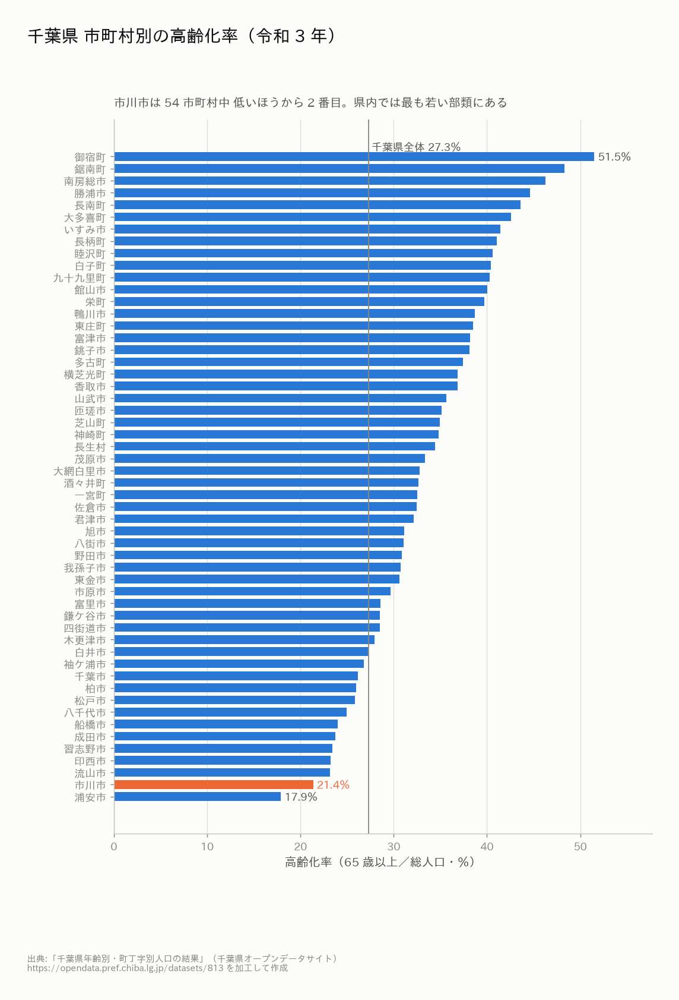
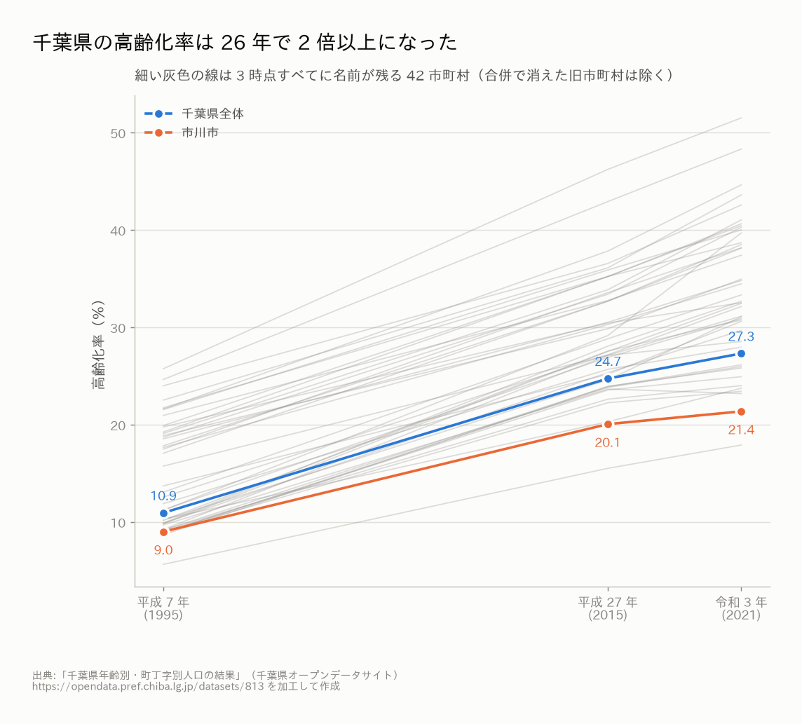
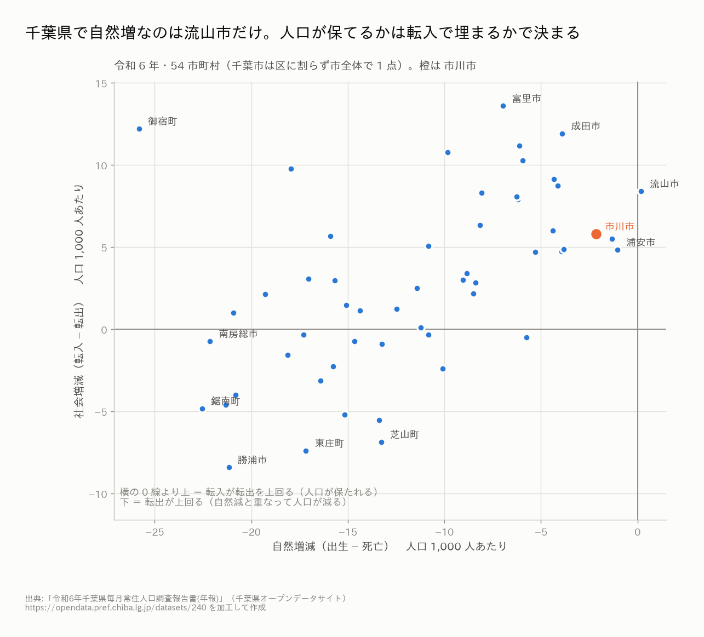
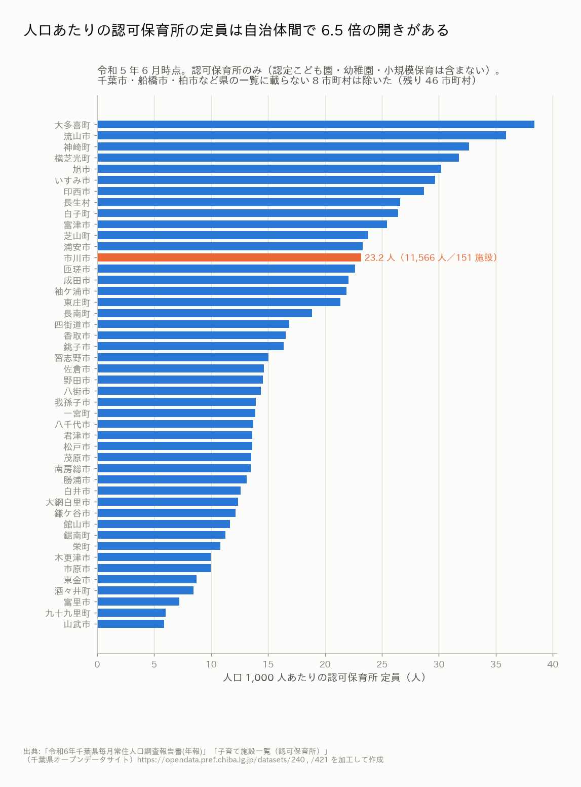
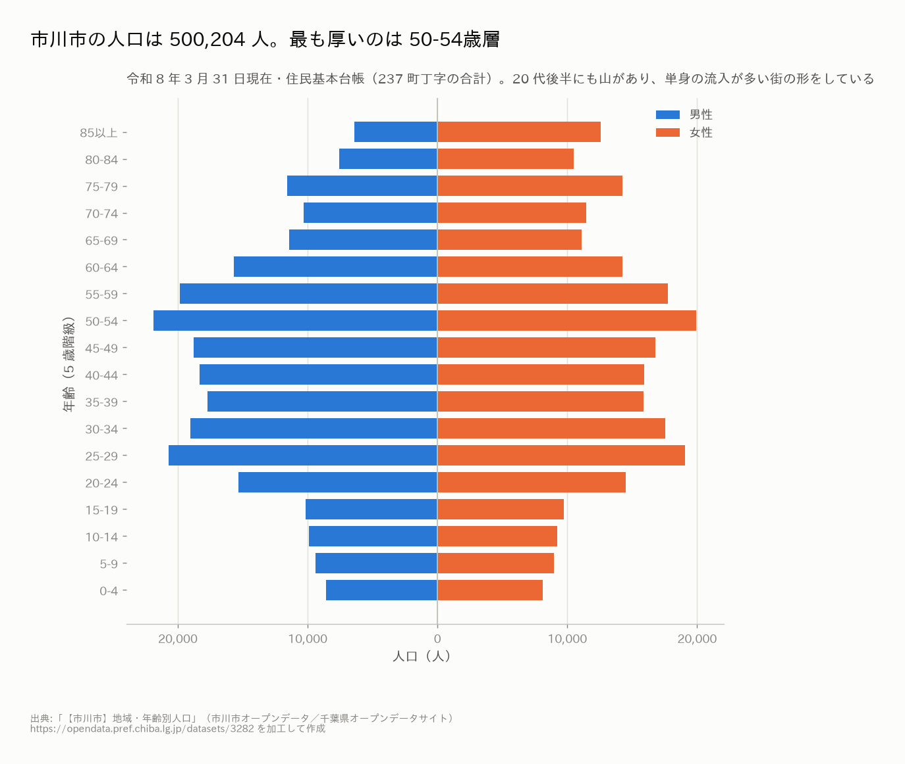
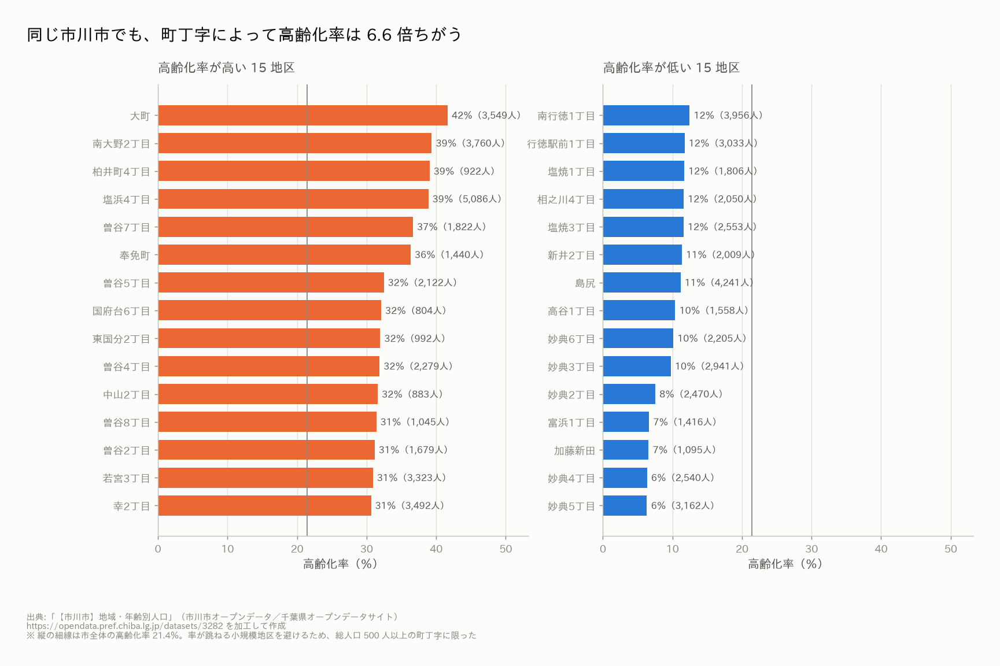
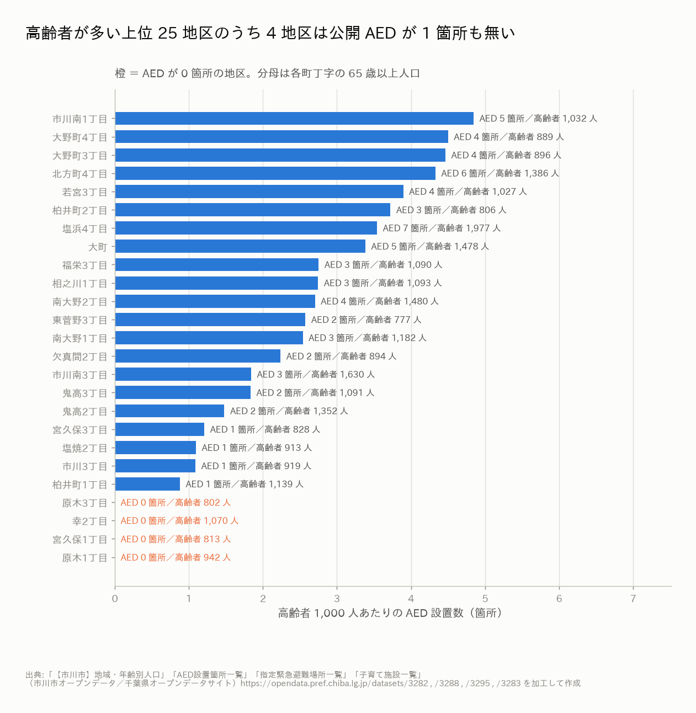
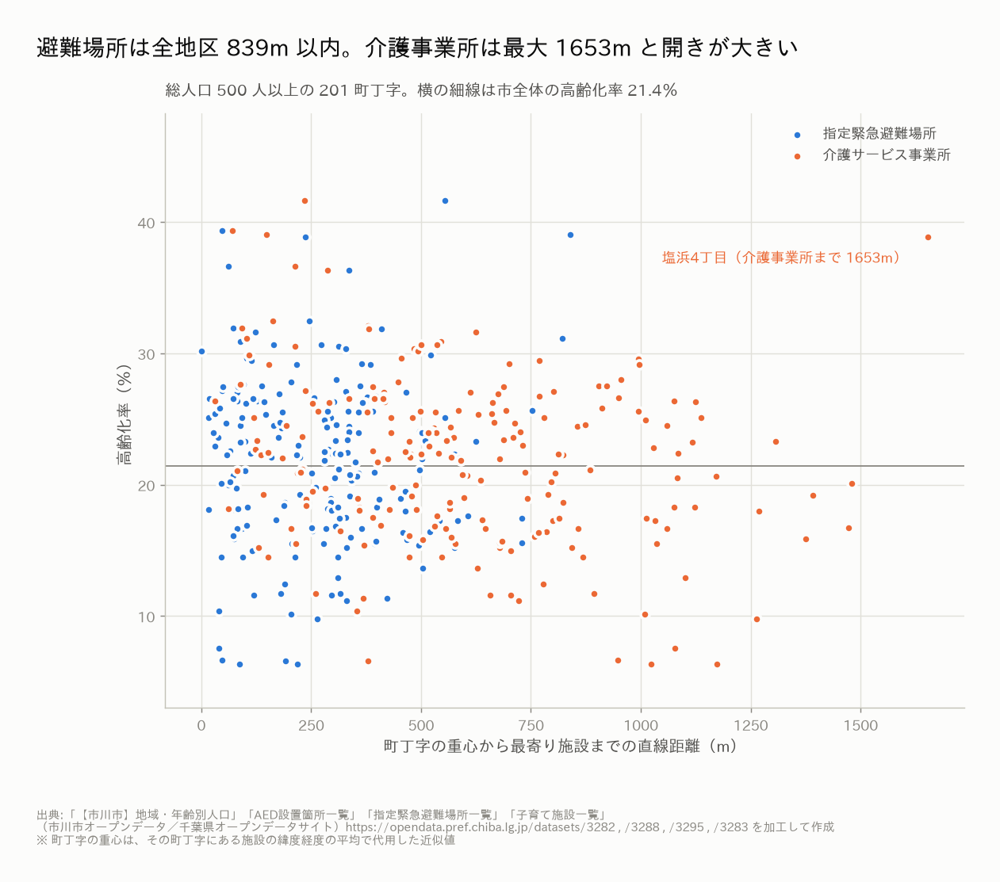
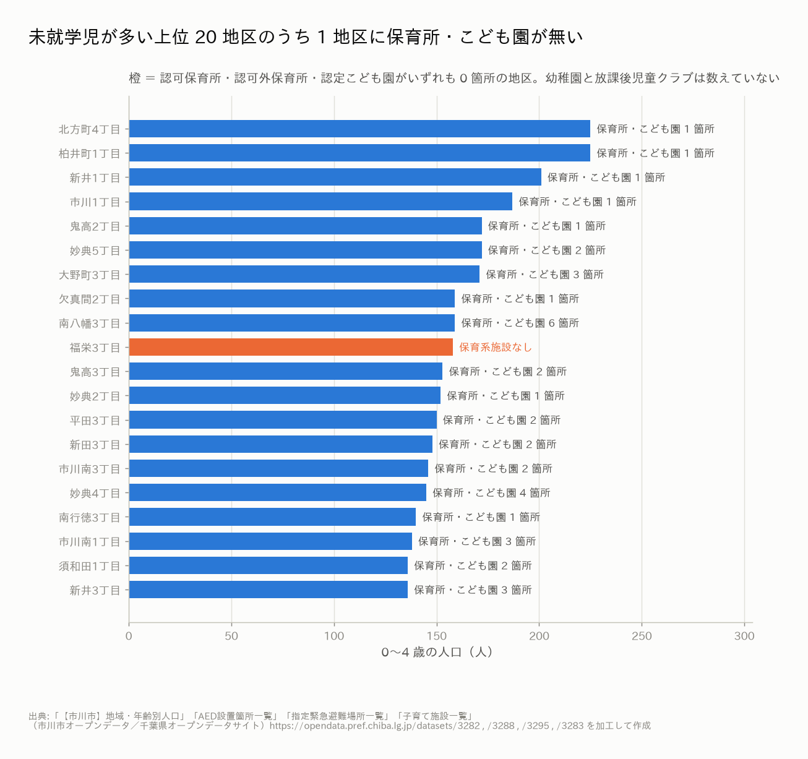

# 探索的データ分析の所見（2026-08-24）

このメモは**アイデアを決めるための材料**。プロダクトはまだ決めていない。
グラフは `figures/`、生成コードは `scripts/`、元データは `../chiba-pref/raw/` と
`../ichikawa-city/raw/`（出典と利用条件は各 `SOURCE.md`）。

再現手順は [`README.md`](README.md)。

---

## 使ったデータ

| 出典 | データ | 時点 |
|---|---|---|
| 千葉県オープンデータサイト | 令和6年千葉県毎月常住人口調査報告書(年報) 第1〜3表 | 令和6年（2024） |
| 千葉県オープンデータサイト | 千葉県年齢別・町丁字別人口の結果（市町村別の高齢者人口） | 平成7・27年／令和3年 |
| 千葉県オープンデータサイト | 子育て施設一覧（認可保育所） | 令和5年6月 |
| 市川市オープンデータ | 地域・年齢別人口 | 令和8年3月31日現在 |
| 市川市オープンデータ | AED設置箇所／指定緊急避難場所／介護サービス事業所／子育て施設 一覧 | 令和8年4月1日 |

---

## 1. 千葉県の高齢化は 26 年で 2 倍以上。ただし市町村差が非常に大きい

- 千葉県全体の高齢化率は **平成7年 10.9％ → 平成27年 24.7％ → 令和3年 27.3％**
- 令和3年の市町村別では **御宿町 51.5％ が最高、浦安市 17.9％ が最低**で **約 2.9 倍**の開き
- **市川市は 21.4％ で 54 市町村中 下から 2 番目**。県内では最も若い部類
- 高齢化率が 40％ を超えるのは房総半島南部・東部（御宿町・鋸南町・南房総市・勝浦市など）に集中

> **アイデアに繋がりそうな観察**
> 「千葉県の高齢化」を一枚で語ると外す。**同じ県内に 51.5％ の町と 17.9％ の市が同居している**ので、
> 課題は「県全体の高齢化」ではなく「**自治体ごとに異なる段階の課題**」として立てたほうが刺さる。
> 逆に、市川市を題材にするなら「高齢化がまだ軽いうちに手を打つ」という切り口が自然。

## 2. 千葉県で自然増なのは流山市だけ。差がつくのは「転入で埋められるか」

- 令和6年、**54 市町村のうち自然増（出生＞死亡）は流山市 1 つだけ**。他はすべて自然減
- 人口が保てるかどうかは社会動態（転入−転出）で決まる。
  富里市・成田市・流山市・市川市・浦安市は転入超過が大きい
- 勝浦市・芝山町・東庄町・鋸南町は自然減と転出超過が重なる

> **アイデアに繋がりそうな観察**
> 「人を増やす」施策は千葉県内の**ゼロサム（奪い合い）**になりやすい。
> 転入した人が**定着する**ための情報や、転入直後につまずく手続き・施設探しを
> 助ける方向のほうが、どの自治体にも損がない。

## 3. 人口あたりの認可保育所定員は自治体間で 6.5 倍の開き

- 人口 1,000 人あたりの認可保育所定員は **大多喜町 38.4 人 〜 山武市 5.9 人**
- 市川市は **23.2 人（定員 11,566 人／151 施設）** で 46 市町村中 上位
- ただし県の一覧は**認可保育所のみ**で、千葉市・船橋市・柏市など 8 市町村は載らない。
  認定こども園・幼稚園・小規模保育も含まないので、**「保育の受け皿の全量」ではない**

> **アイデアに繋がりそうな観察**
> 自治体をまたいで比較できる子育てデータは、思ったより揃っていない。
> **「比較できる形に整えること」自体がサービスになりうる**（ただし新規性は要検討）。

## 4. 市川市は 50 万人都市。20 代後半にもう一つの山がある

- 総人口 **500,204 人**（237 町丁字の合計・令和8年3月31日現在）
- 最も厚いのは **50-54 歳**。加えて **25-29 歳に第二の山**があり、単身の流入が多い街の形
- 0-4 歳は各階級の中で最も薄い

> **アイデアに繋がりそうな観察**
> 20 代後半の流入層は**この街に長くいるとは限らない層**。
> 転入直後に必要な情報（ゴミ・防災・医療・手続き）が届いていない可能性が高い。
> 一方 50 代の厚い層は **10 年後にまとめて高齢者になる**ので、
> 「今は若いが 2035 年に急に高齢化する街」という時間軸の切り口が取れる。

## 5. 同じ市川市でも、町丁字によって高齢化率は 6.6 倍ちがう

- 総人口 500 人以上の 211 地区で、**最高 41.6％（大町）〜 最低 6.3％**。市全体は 21.4％
- 高いのは**北部（大町・柏井町・曽谷・南大野・国府台）**。
  曽谷・大野・柏井・大町の 20 地区の平均は **28.8％**
- 低いのは**南部の行徳・妙典エリア**。妙典／行徳／南行徳の 14 地区の平均は **12.8％**
- 塩浜4丁目は高齢化率 39％ かつ人口 5,086 人と、規模の大きい高齢地区

> **アイデアに繋がりそうな観察**
> **「市の平均」で設計したサービスは、市内のどの地区にも合わない。**
> 市川市は 1 つの市の中に「房総南部と同じくらい高齢な地区」と「県内で最も若い地区」が同居している。
> **町丁字単位で見せる／出し分ける**こと自体が、既存の自治体サービスに対する差になりうる。

## 6. 高齢者が多い地区でも AED が 1 箇所も無いところがある

- 公開されている AED は市内 **305 箇所**（うち座標が使えるのは 302 箇所）
- **237 町丁字のうち 96 地区は AED が 0 箇所**。
  そのうち **高齢者が 500 人以上いる地区が 19 地区**
- 高齢者人口が多い上位 25 地区に限っても、**幸2丁目・原木1丁目・宮久保1丁目・原木3丁目の 4 地区が 0 箇所**
  （それぞれ高齢者 802〜1,070 人）

> **アイデアに繋がりそうな観察**
> 「AED マップ」は既にいくつもある。差がつくのは**地図に載っていない側（空白地）を指摘する**方向。
> 設置箇所を探すアプリではなく、**どこに増やすべきかを自治体・事業者に返す**使い方なら新規性が出る。
> 元データに `利用可能曜日`・`開始/終了時間` があるので、「**夜間に使える AED**」で絞ると空白はさらに広がるはず（未検証）。

## 7. 避難場所は全地区 839m 以内。介護事業所は最大 1,653m と開きが大きい

- 町丁字の重心から最寄りの**指定緊急避難場所**まで：中央値 279m・**最大でも 839m**（面的に整っている）
- 最寄りの**介護サービス事業所**まで：中央値 567m・**最大 1,653m**（塩浜4丁目）
- 高齢化率と距離の相関は弱い（避難場所 r≈0.01、介護事業所 r≈−0.31）。
  **介護事業所はむしろ高齢地区に寄って立地している**

> **アイデアに繋がりそうな観察**
> 市川市の防災インフラは配置としては行き届いている。**「箱が足りない」課題は立てにくい。**
> 課題があるとすれば配置ではなく**「使われ方・届き方」**の側（誰がどこへ行けばいいか分からない、
> 開いている時間が分からない、など）。

## 8. 未就学児が多い地区で保育所・こども園が 0 なのは 1 地区

- 0〜4 歳が多い上位 20 地区のうち、認可・認可外保育所と認定こども園がすべて 0 なのは **福栄3丁目のみ**
- 逆に南八幡3丁目は 6 箇所、妙典4丁目は 4 箇所と密集している地区もある

> **アイデアに繋がりそうな観察**
> 施設「数」の空白はほぼ無い。ここも**量ではなく質・マッチングの問題**とみるのが妥当。
> ただし **`収容定員` 列が全行空**なので、定員ベースの充足率は市のオープンデータだけでは出せない。
> 定員が要るなら県の認可保育所一覧（`../chiba-pref/raw/licensed_nursery_schools_2023.xlsx`）と突き合わせる必要がある。

---

## データそのものについて気づいたこと（審査の「オープンデータの活用」で使えるかもしれない）

1. **市川市のデータは県のポータル経由ではダウンロードできない。**
   43 リソースのうち 42 が `resource_download` で HTTP 500 を返す（2026-08-24 時点）。
   市の公式サイトの直リンクなら取れる。**カタログとして機能していない**
2. **AED 一覧に座標の打ち間違いが 1 件ある**
   （「ローソンストア100市川南八幡三丁目店」の経度が `129.925207`。正しくは 139.9…）。
   そのまま地図に出すと日本海の沖に点が立つ
3. **子育て施設一覧の `収容定員` は 388 行すべて空**。列はあるが値が入っていない
4. **町字名の表記が揺れている**（全角数字・空白・`市川市` の前置き）。
   人口データと施設データを突き合わせるには正規化が要る
5. **県サイトの一部リソースは名前と中身が違う**
   （「令和元年 観光入込調査」の中身は令和3年の報告書）
6. **機械判読できる形になっていないデータが多い。** 県サイトの全 3,457 データセットのうち
   CSV を 1 つでも含むのは **1,144 件（33.1％）**、リソース単位で見ると
   **51,666 件中 CSV は 2,279 件（4.4％）** しかない。残りは PDF と Excel
   （並行作業のカタログダンプを自分で集計した数値。ダンプの取得は別セッション）

> **アイデアに繋がりそうな観察**
> 「オープンデータを使う」だけでなく「**オープンデータの品質を可視化して自治体に返す**」という
> 立て方もできる。審査基準の「オープンデータの活用」と「新規性」の両方に効く可能性がある。
> ただし**住民の課題解決から遠い**ので、これ単体をプロダクトにするのは危うい。

---

## 未検証・この分析でやっていないこと

- **町丁字の境界（ポリゴン）は使っていない。** 市川市は境界データを公開していないため、
  町丁字の位置は「その町丁字にある施設の緯度経度の平均」で代用した近似値。
  面積・人口密度・徒歩圏の厳密な計算はできていない
- **距離はすべて直線距離**。実際の徒歩ルート（川・線路・高速道路の分断）は考慮していない。
  市川市は江戸川・京葉道路・JR/東西線で市域が分断されているので、実距離はもっと長い
- 高齢者の**要介護度・独居率**は市のオープンデータに無く、施設の利用実態は分からない
- 観光データ（`tourism_visitors_2019.xls`）は取得しただけで**まだ分析していない**
