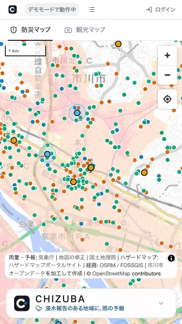
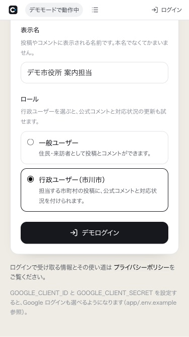
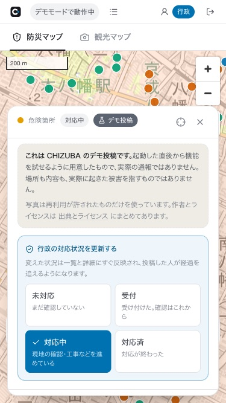

# 01. はじめての操作

**あなたが誰かによって、最初にやることが違う。** 該当するものから読む。

| あなた | 節 |
|---|---|
| **住民** — 危険な場所や冠水を報告したい／近所のハザードを見たい | [1-1](#1-1-住民として使う) |
| **行政の担当者** — 寄せられた投稿に返答したい | [1-2](#1-2-行政の担当者として使う) |
| **来訪者** — 千葉の見どころを探したい | [1-3](#1-3-来訪者として使う) |
| **審査員・見学者** — 全機能を短時間で試したい | [1-4](#1-4-審査員として短時間で全機能を見る) |

---

## 1-1. 住民として使う

### ① まず見る（ログイン不要）

1. <http://localhost:3000> を開く
2. **防災マップ**が最初に出る。ピンク〜赤に塗られているのが**洪水の浸水想定区域**
3. 地図の点は 3 種類:
   - **青** = 指定緊急避難場所（123 か所）
   - **朱** = AED 設置箇所（304 か所）
   - **緑** = 子育て施設（388 か所）
4. **輪の付いた大きめの点**が住民と行政の投稿。押すと詳細が開く
   - **橙** = 危険箇所／**水色** = 浸水／**桃** = 観光おすすめ
   - **青い輪**が付いているものは**行政の投稿**

### ② 自分の家の近くを確かめる

- 地図を**指で動かして拡大**する（PC はドラッグとホイール）
- 右上の **◎ ボタン**で現在地へ移動できる（初回はブラウザが位置情報の許可を聞く）
- 下の帯（スマホ）または左のパネル（PC）を開くと、
  **ハザードの種類を切り替え**られる（洪水・高潮・津波）

### ③ 危険な場所を見つけたら報告する

**ログインが必要。** 手順は [03 章 3-2](03-howto.md#3-2-危険箇所を投稿する)。

おおまかには「ログイン → 操作パネルの『危険箇所を投稿する』→ 地図で場所を押す →
タイトル・説明・写真を入れて送信」。

### ④ 雨の日に見る

雨の予報が出ていて、過去にその地域で浸水の報告があるときは、
**パネルの一番上に注意案内が出る**。

> **これは浸水の予測ではない。**
> 「過去にこの地域で浸水の報告が N 件あった」と
> 「気象庁の予報では降水確率が最大 X%」という**事実を 2 つ並べているだけ**。

---

## 1-2. 行政の担当者として使う

### ① 行政ユーザーでログインする

1. 右上の「ログイン」を押す
2. 表示名を入れる（例: `デモ市役所 道路担当`）
3. ロールで「**行政ユーザー（市川市）**」を選ぶ
4. 公開されている環境では **PIN を聞かれる**ことがある（運用している人に聞く）
5. 「デモログイン」を押す

ログインすると、画面上部に**青い「行政」バッジ**が出る。

### ② 寄せられた投稿を見る

上部の「**投稿一覧**」（スマホではリストのアイコン）を押すと、新着順で並ぶ。
カテゴリ・期間・キーワードで絞り込める。

### ③ 対応状況を更新する

投稿の詳細を開くと、**行政ユーザーにだけ**「行政の対応状況を更新する」が出る。

| 段階 | いつ選ぶか |
|---|---|
| **未対応** | まだ確認していない |
| **受付** | 受け付けた。確認はこれから |
| **対応中** | 現地の確認・工事などを進めている |
| **対応済** | 対応が終わった |

押すとすぐ保存され、**一覧と地図にも即座に反映される**。

### ④ 公式コメントを返す

同じ詳細パネルの下にコメント欄がある。
**行政ユーザーが書いたコメントには自動で「行政の公式回答」の印が付く**
（自分で選ぶ操作は無い）。

> **担当している市町村の投稿にだけ**公式扱いになる。
> 他市の投稿にコメントすると、普通のコメントとして残る。

### ⑤ 行政からお知らせを出す

行政ユーザーも**普通に投稿できる**。
「土のうステーションを開設しました」のようなお知らせを、地図の上に置ける。
行政の投稿は**地図のピンに青い輪**が付き、詳細に「行政の公式投稿」の印が出る。

---

## 1-3. 来訪者として使う

### ① 観光マップに切り替える

画面の上の「**観光マップ**」タブを押す。
ハザードと施設の点が消え、**景観100選（100 か所）**が出る。

### ② 見どころを開く

点を押すと、**写真・日本語と英語の解説・アクセス方法**が出る。

- 写真の下の「**撮影: ◯◯ / CC BY 3.0**」は写真の作者とライセンス。
  押すと元のページへ飛ぶ
- 「**日本語 / English**」で解説を切り替えられる
- 色は景観のカテゴリ（**青**=まち並み・**緑**=自然・**朱**=歴史・文化・**桃**=生活風景）

### ③ そこまで歩く

ポップアップの下の「**ここへナビ**」を押すと、現在地からの徒歩ルートが出る。

### ④ おすすめを投稿する

**ログインが必要。** 観光マップで「観光おすすめを投稿する」を押し、
地図で場所を指定してから、写真と説明を入れる。

---

## 1-4. 審査員として短時間で全機能を見る

**5 分でひととおり触る順番。**

| # | やること | 見えるもの |
|---|---|---|
| 1 | `cd app && docker compose up` → <http://localhost:3000> | 防災マップ。**起動直後からデモ投稿 22 件が入っている** |
| 2 | 下の帯（スマホ）／左のパネル（PC）を開く | 注意案内（F-4）・検索・レイヤーの ON/OFF |
| 3 | 「洪水浸水想定区域」の**不透明度スライダー**を動かす | ハザードの重ね（F-1）と 6 段階の凡例 |
| 4 | 地図の**橙のピン**を押す | 投稿の詳細（写真・本文・対応状況・コメント）（F-2） |
| 5 | **水色のピン**を押す | 浸水報告。**投稿時点の雨量**が入っている（F-3） |
| 6 | 「ログイン」→ 表示名を入れて**行政ユーザー**を選ぶ | デモログイン（F-8） |
| 7 | もう一度ピンを押す | **対応状況の 4 段階**と公式コメント欄（F-7） |
| 8 | パネルの「危険箇所を投稿する」→ 地図をクリック | 投稿フォーム。写真も付けられる |
| 9 | 上部タブの「**観光マップ**」 | 景観100選 100 か所（F-5）。点を押すと写真と日英解説 |
| 10 | ポップアップの「**ここへナビ**」 | 徒歩ルート（距離と所要時間） |
| 11 | 上部の「投稿一覧」→ 「**CSV**」 | 投稿をオープンデータとして書き出す |
| 12 | フッターの「詳しい出典」 | 使っているデータと写真 71 枚の出典 |

**認証キーは 1 つも要らない。**
Google の鍵を設定していない環境では、上部に「**デモモードで動作中**」と出続ける。
