# 02. 画面の説明

**全画面・全ボタン・全トグルの意味と、押すとどうなるか。**
ここに挙げたボタンは、実際に動かして数えたもの（2026-09-03）。

画面は 6 つ + 重なって出るもの 2 つ。

| 画面 | URL | ログイン |
|---|---|---|
| [地図（防災マップ）](#2-2-地図防災マップ) | `/` | 不要 |
| [地図（観光マップ）](#2-3-地図観光マップ) | `/?mode=tourism` | 不要 |
| [投稿の詳細](#2-4-投稿の詳細重なって出る) | 地図の中に重なる | 閲覧は不要 |
| [投稿フォーム](#2-5-投稿フォーム重なって出る) | 地図の中に重なる | **必要** |
| [投稿一覧](#2-6-投稿一覧-reports) | `/reports` | 不要 |
| [ログイン](#2-7-ログイン-login) | `/login` | — |
| [出典とライセンス](#2-8-出典とライセンス-about) | `/about` | 不要 |
| [プライバシーポリシー](#2-9-プライバシーポリシー-privacy) | `/privacy` | 不要 |

---

## 2-1. どの画面にもある上の帯

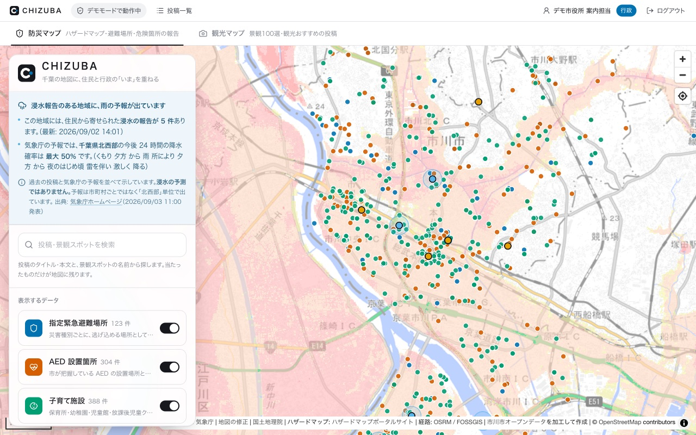

高さ 40px。**画面の幅で出るものが変わる**（スマホでは文字を減らしてアイコンだけにする）。

| 位置 | 何 | 押すとどうなる |
|---|---|---|
| 左端 | **CHIZUBA のロゴ**（と文字） | 地図（トップ）へ戻る |
| その右 | 「**デモモードで動作中**」 | 押せない。**Google の認証キーが設定されていない**ことを示す表示 |
| その右 | **投稿一覧**（スマホではリストのアイコン） | `/reports` へ移動 |
| 右端 | **ログイン** または **表示名 ＋ ログアウト** | ログイン画面へ／ログアウトして地図へ戻る |
| 右端 | 青い「**行政**」バッジ | 押せない。行政ユーザーでログイン中であることを示す |

---

## 2-2. 地図（防災マップ）

`/` を開いたときの既定。上部のタブで観光マップに切り替えられる。

### タブ（2 つ）

| タブ | 出るもの |
|---|---|
| **防災マップ** | ハザードマップ・避難場所・危険箇所の報告 |
| **観光マップ** | 景観100選・観光おすすめの投稿 |

**切り替えても地図は作り直されない。** 表示する組が変わるだけで、
切り替えたあと個別に足し引きしてよい（例: 観光マップのまま避難場所も出す）。

### 地図そのもの

| 操作 | 動き |
|---|---|
| ドラッグ／指で払う | 移動 |
| ホイール／ピンチ | 拡大縮小 |
| 点を押す | **施設・景観スポット**はポップアップ、**投稿**は詳細パネルが開く |
| **回転・傾き** | **できない**（北がどちらか分からなくなるので無効にしてある） |

### 地図の右上（3 つ）

| ボタン | 動き |
|---|---|
| **＋ 拡大** | 1 段拡大 |
| **− 縮小** | 1 段縮小 |
| **◎ 現在地を表示** | 現在地へ寄せる。初回はブラウザが位置情報の許可を聞く。**拒否するとボタンが無効になる**（それ以上何も起きない） |

### 地図の左下・右下

| 位置 | 何 |
|---|---|
| 左下 | **縮尺バー**（メートル法） |
| 右下 | **出典**（気象庁・国土地理院・ハザードマップポータルサイト・OSRM・OpenStreetMap・市川市オープンデータ）。ⓘ で開閉 |

### 操作パネル

**PC では左に固定、スマホでは下から出るシート。**
スマホでは**最初は畳まれている**（開いたままだと地図が高さ 119px しか見えないため）。

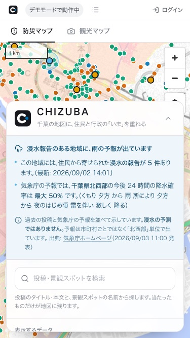

上から順に、次のものが並ぶ。

#### ① 注意案内（条件を満たすときだけ）

雨の予報があり、かつ過去にその地域で浸水の報告があるときだけ出る。
出さない条件は「予報が取れない」「雨の予報が出ていない」「浸水報告が 0 件」の 3 つ。

書いてあること:

- 「この地域には、住民から寄せられた**浸水の報告が N 件**あります。（最新: 日付）」
- 「気象庁の予報では、**千葉県◯◯部**の今後 24 時間の降水確率は **最大 X%** です」＋気象庁の天気文
- 「**浸水の予測ではありません。** 予報は市町村ごとではなく『◯◯部』単位で出ています」

畳んだ状態のときは、**ヘッダーに「浸水報告のある地域に、雨の予報」の 1 行だけ**が出る。

#### ② 徒歩ナビの結果（経路を引いたときだけ）

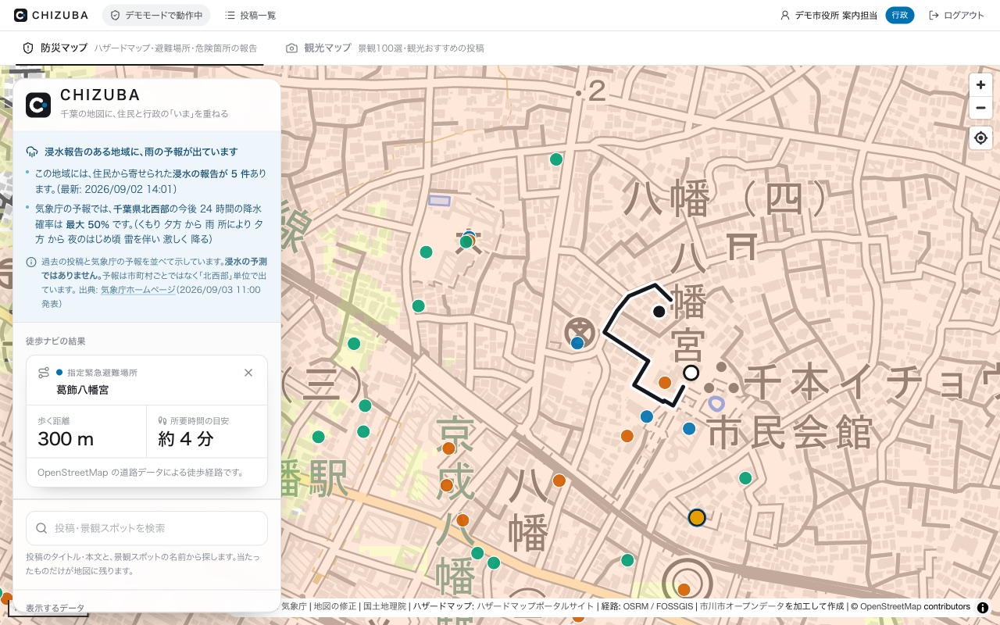

| 項目 | 中身 |
|---|---|
| 色チップと種別 | どのレイヤーの地点か（「指定緊急避難場所」など） |
| 名前 | 目的地の名前 |
| **歩く距離** | メートルまたはキロメートル |
| **所要時間の目安** | 「約 4 分」 |
| 下の 1 行 | 「OpenStreetMap の道路データによる徒歩経路です。」／取れなかったときは「**直線距離の概算**」の断り |
| **×** | 経路を消す |

#### ③ 検索欄

「投稿・景観スポットを検索」。**打った語は地図そのものにも効く**（当たったピンだけが残る）。

- 投稿は**タイトルと本文**、景観スポットは**名前（日英）と所在地**を探す
- 全角/半角・大文字/小文字は区別しない（「ｱﾝﾀﾞｰﾊﾟｽ」でも当たる）
- 下に候補が最大 8 件出る。押すと地図がそこへ寄る
- **×** で消す

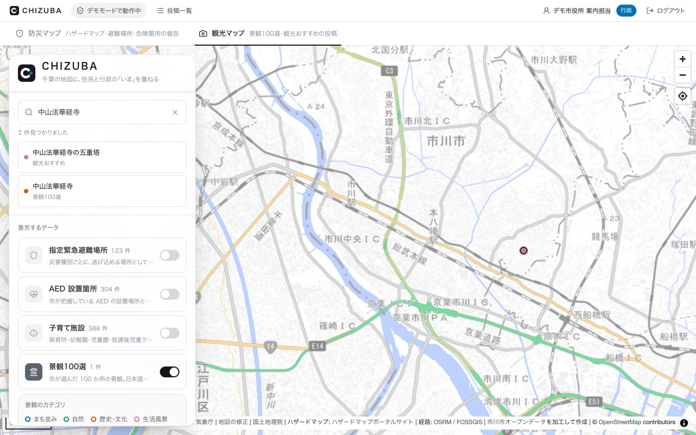

#### ④ 表示するデータ（トグル 4 つ）

| トグル | 件数 | 既定（防災 / 観光） |
|---|---|---|
| **指定緊急避難場所** | 123 件 | ON / OFF |
| **AED 設置箇所** | 304 件 | ON / OFF |
| **子育て施設** | 388 件 | ON / OFF |
| **景観100選** | 100 件 | OFF / **ON** |

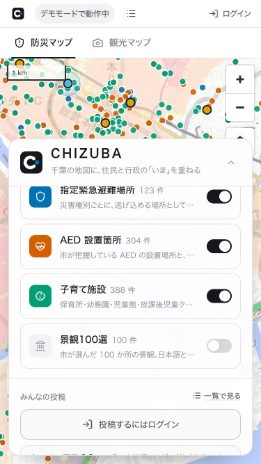

景観100選を ON にすると、その下に**カテゴリの凡例**（まち並み・自然・歴史・文化・生活風景）が出る。

> 件数は**いま地図に出ている数**。検索で絞ると減る。

#### ⑤ みんなの投稿

| 何 | 動き |
|---|---|
| **一覧で見る** | `/reports` へ移動 |
| **「◯◯を投稿する」ボタン** | 押すと**地図をクリックして場所を指定**する状態になる。防災マップでは危険箇所・浸水の 2 つ、観光マップでは観光おすすめの 1 つ |
| 「**投稿するにはログイン**」 | 未ログインのときはボタンの代わりにこれが出る |
| **いまの雨量**（浸水を投稿できるときだけ） | 最寄りのアメダスの 1 時間降水量・観測所名・距離・観測時刻 |
| トグル **危険箇所 / 浸水 / 観光おすすめ** | 地図に出す・出さないを切り替える |
| 下の 2 行 | 「ピンをクリックすると…」「**青い輪のピンは行政の投稿です**」 |

#### ⑥ 期間でしぼる

| ボタン | 期間 |
|---|---|
| **すべて** | 全期間（既定） |
| **今日** | 今日 1 日 |
| **7 日間** | 今日を含む 7 日 |
| **30 日間** | 今日を含む 30 日 |
| 日付欄 2 つ | 開始日・終了日を自分で決める。片方だけでもよい |
| **解除** | 期間の指定を消す |

日付は**日本時間の暦日**。両端を含む（終了日に指定した日の 23:59 まで）。

> **注意案内（①）は期間の絞り込みに引きずられない。**
> 絞ったせいで「過去に浸水報告はありません」になると防災の判断を誤らせるため。

#### ⑦ オープンデータとして持ち帰る

| ボタン | 出るもの |
|---|---|
| **CSV** | 表計算ソフトで開ける形式（UTF-8・Excel でも文字化けしない） |
| **GeoJSON** | 地図ソフトで開ける形式（QGIS など） |

**いま絞り込んでいる条件のまま**書き出す。
投稿者の**表示名までを含み、アカウントの情報は含まない**。

#### ⑧ 徒歩ナビ

| ボタン | 動き |
|---|---|
| **現在地から最寄りの地点へ** | 現在地を取り、**表示中の点のうち直線距離が最も近いもの**への徒歩経路を引く。位置情報が取れなければ地図クリックに切り替わる |
| **出発地点を地図で指定する** | 押したあと地図をクリックすると、そこを出発地点にして最寄りへの経路を引く |
| 出発地点の座標 | 決まっていれば下に表示される |

**データを 1 つも表示していないと「最寄りの地点へ」は押せない**（そのときは
「データを 1 つ以上表示すると、最寄りの地点を探せます。」と出る）。

#### ⑨ ハザードマップ（浸水・土砂災害）

| トグル | 内容 | 既定 |
|---|---|---|
| **洪水浸水想定区域** | 想定しうる最大規模の降雨で川が氾濫した場合の浸水の深さ | **ON** |
| **高潮浸水想定区域** | 想定しうる最大規模の台風で潮位が上がった場合 | OFF |
| **津波浸水想定** | 都道府県が公表している津波の浸水想定 | OFF |
| **土砂災害（急傾斜地の崩壊）** | 崖崩れのおそれがあるとして指定された区域 | OFF |

ON にすると、その行の下に**不透明度のスライダー**（10〜100%・既定 60%）が出る。

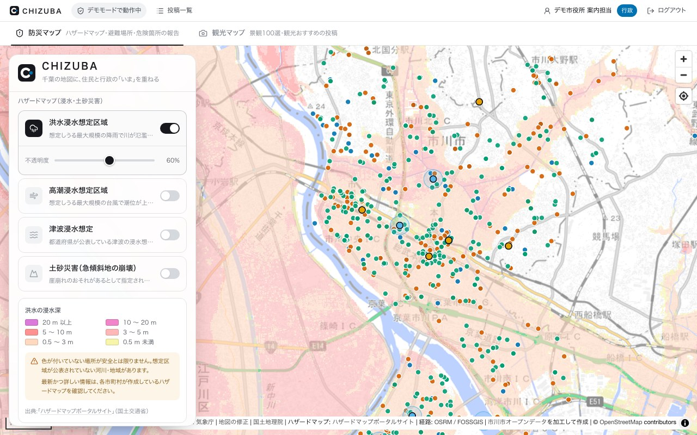

> **この画像は土砂災害のトグルを足す前のもの**なので、トグルが 3 つしか写っていない。
> 実際の画面には 4 つ並ぶ。

その下に**凡例**が出る。**洪水は 6 段階、津波・高潮は 8 段階**で、同じ色でも表す深さが違う。
**土砂災害だけは深さではなく区域の種別**（特別警戒 / 警戒 × 指定済 / 指定予定の 4 区分）で、
青い破線で囲まれているものが「指定予定」。表示中のものに合わせて出し分ける。

**土砂災害の指定は斜面のある場所に限られる。** 市川市では北部（国分・国府台・中山・曽谷など）に
偏っていて、南部の低地には出ない。何も塗られなくても「危険が無い」という意味ではない。

凡例には**必ず 2 行の注意書き**が付く:

> - 色が付いていない場所が安全とは限りません。想定区域が公表されていない河川・地域があります。
> - 最新かつ詳しい情報は、各市町村が作成しているハザードマップを確認してください。

**地図を引きすぎる（ズーム 6 未満）と重ねが消える。** 想定区域が数ピクセルの染みにしか
ならないため。千葉県内を見ている限り消えることはない。

#### ⑩ フッター

出典の 1 行と、「**詳しい出典**」（`/about`）・「**プライバシー**」（`/privacy`）へのリンク。

---

## 2-3. 地図（観光マップ）

`/?mode=tourism`。防災マップと**同じ画面**で、最初から出るものが違うだけ。

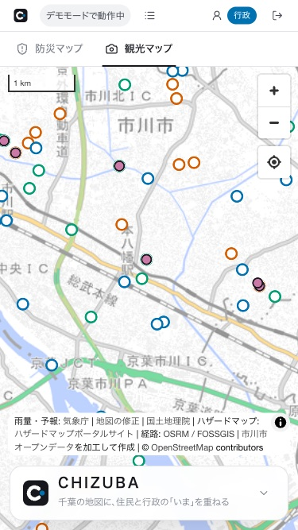

| | 防災マップ | 観光マップ |
|---|---|---|
| 施設の 3 レイヤー | ON | OFF |
| 景観100選 | OFF | **ON** |
| ハザード | 洪水だけ ON | 全部 OFF |
| 投稿 | 危険箇所・浸水 | 観光おすすめ |
| 投稿できるもの | 危険箇所・浸水 | 観光おすすめ |

### 景観スポットのポップアップ

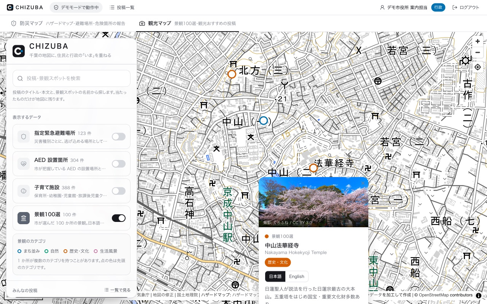

| 部分 | 中身 |
|---|---|
| **写真**（54 か所にある） | 下に「撮影: 作者名 / ライセンス」。作者名を押すと出典ページ、ライセンス名を押すと条文へ |
| 種別と名前 | 「景観100選」＋日本語名＋英語名 |
| **カテゴリのタグ** | 1 か所が最大 3 つ持つ |
| **日本語 / English** | 解説と項目名を切り替える（名前は日英とも常に出る） |
| 解説 | 元データの文章をそのまま出す（翻訳も要約もしない） |
| アクセス・所在地・電話・関連ページ | あるものだけ出る（アクセスは 100 件中 73 件にしかない） |
| **ここへナビ** | 下に固定。押すと徒歩経路を引く |

### 施設のポップアップ

避難場所・AED・子育て施設の点を押したとき。

| 部分 | 中身 |
|---|---|
| 種別と名前 | 色チップ＋「指定緊急避難場所」など |
| 所在地 | あれば |
| レイヤーごとの項目 | 避難場所: 対応する災害・想定収容人数・電話／AED: 設置位置・利用できる曜日と時間・備考・電話／子育て: 種別・受入年齢・開所時間・電話 |
| **ここへナビ** | 下に固定 |

---

## 2-4. 投稿の詳細（重なって出る）

地図のピンを押すか、一覧から「地図で見る」で開く。

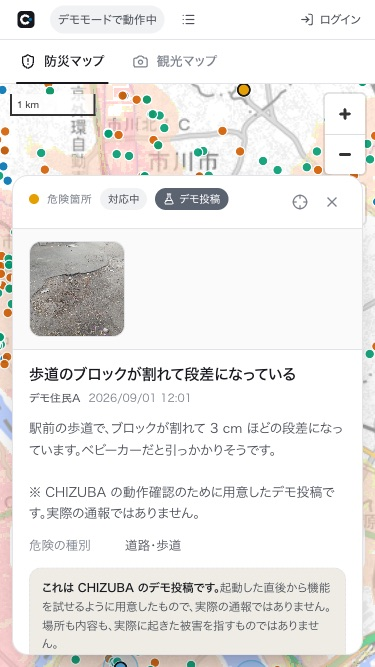

### 見出しの帯

| 印 | 意味 |
|---|---|
| 色チップ＋**カテゴリ名** | 危険箇所／浸水／観光おすすめ |
| **対応状況** | 未対応／受付／対応中／対応済 |
| 青い「**行政の公式投稿**」 | 行政ユーザーが出した投稿 |
| 灰色の「**デモ投稿**」 | 起動時から入っている動作確認用のデータ。**実際の通報ではない** |
| **◎ ボタン** | この投稿の場所へ地図を移動 |
| **× ボタン** | 閉じる |

### 本文の部分

- **写真**（あれば横に並ぶ。押すと原寸で開く）
- タイトル・投稿者の表示名・投稿日時
- 本文
- **カテゴリ固有の項目**（危険の種別／冠水の深さ／おすすめの種別）
- **浸水だけ**: 投稿時点の雨量。「◯◯アメダス（約 N km）」と観測時刻つき。
  取れなかった投稿は「取得できませんでした」と出る
- **デモ投稿だけ**: 「これは CHIZUBA のデモ投稿です」の断り

### 操作（出る人にだけ出る）

| 操作 | 誰に出るか |
|---|---|
| **行政の対応状況を更新する**（4 段階） | 担当している市町村の行政ユーザー |
| **編集する** | **投稿した本人だけ。** タイトル・説明・カテゴリ固有の項目を直せる（**位置と写真は変えられない**） |
| **削除する** | 投稿した本人だけ。押すと「本当に削除する / やめる」の確認が出る |

### コメント

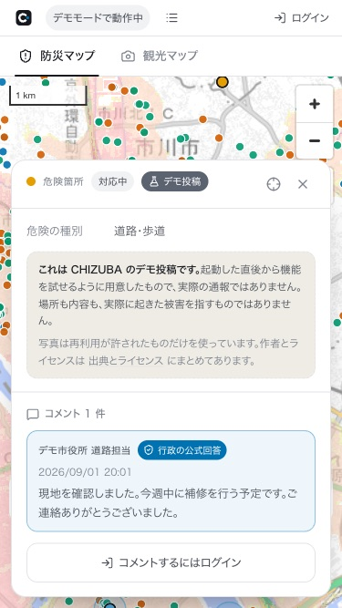

- 古い順に並ぶ
- **行政の公式回答**は青い枠と印が付く（担当市町村の行政ユーザーのコメントに自動で付く）
- 未ログインなら「コメントするにはログイン」が出る
- 500 文字まで。**コメントは編集も削除もできない**

---

## 2-5. 投稿フォーム（重なって出る）

「◯◯を投稿する」を押し、**地図で場所を指定してから**開く。

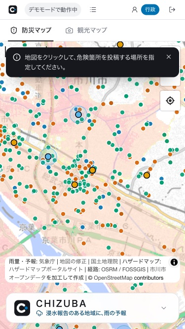

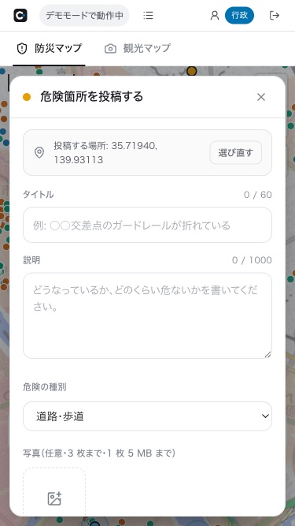

| 欄 | 決まり |
|---|---|
| **投稿する場所** | 地図で指定した座標。「**選び直す**」でやり直せる |
| **タイトル** | 必須・**60 文字まで**（右上に残り数が出る） |
| **説明** | 必須・**1000 文字まで** |
| **カテゴリ固有の項目** | 危険箇所→危険の種別（道路・歩道／照明・電柱／護岸・水路／公園・遊具／その他） 浸水→冠水の深さ（足首まで／膝まで／腰まで） 観光おすすめ→種別（景観／お土産／飲食／その他） |
| **写真** | 任意・**3 枚まで・1 枚 5 MB まで**・JPEG / PNG / WebP。× で外せる |
| **投稿する** | 送信 |
| **×**（右上）／`Esc` | やめる |

**浸水のときだけ**、上に案内が出る:

> 投稿した時点の雨量（最寄りのアメダスの 1 時間降水量）が、この投稿に自動で記録されます。
> 雨量を取得できないときも投稿はそのまま送れます。

一番下に注意書き:

> 投稿は表示名つきで誰でも見られます。自宅や個人が特定できる情報を書かないでください。

---

## 2-6. 投稿一覧（`/reports`）

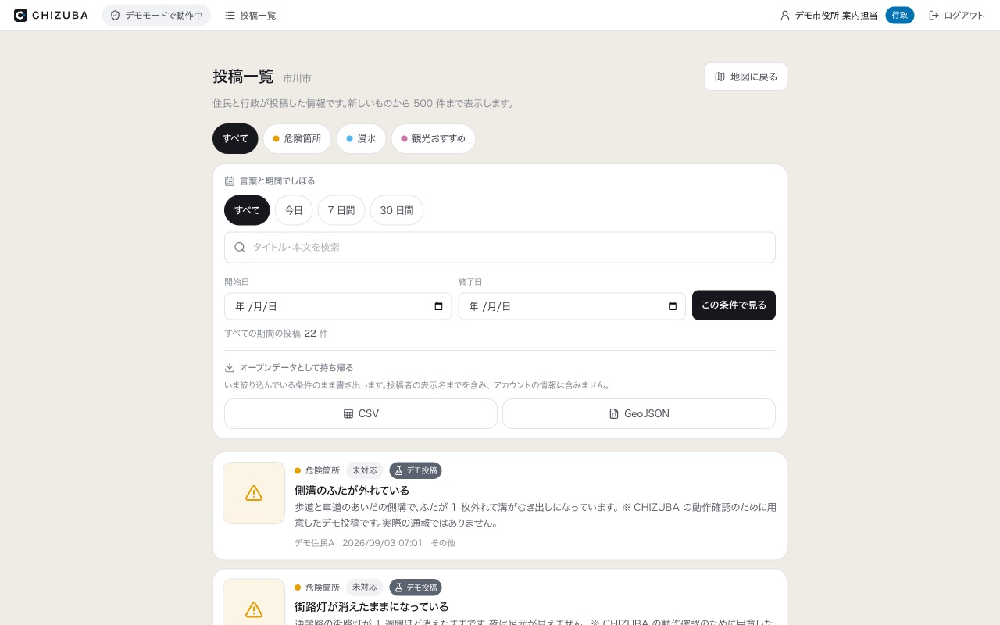

**新着順に 500 件まで。JavaScript が無効でも動く**（絞り込みはリンクと普通のフォーム）。

| 部分 | 中身 |
|---|---|
| 見出し | 「投稿一覧」＋市町村名 |
| **地図に戻る** | `/` へ |
| **カテゴリのチップ** | すべて／危険箇所／浸水／観光おすすめ |
| **期間の近道** | すべて／今日／7 日間／30 日間 |
| **検索欄** | タイトル・本文を探す |
| **開始日 / 終了日** ＋「この条件で見る」 | 期間を自分で決める |
| **解除** | 絞り込みを消す |
| 件数 | 「すべての期間の投稿 22 件」 |
| **CSV / GeoJSON** | いまの条件のまま書き出す |
| **投稿カード** | カテゴリ・対応状況・デモ投稿の印・タイトル・本文の冒頭・投稿者・日時・固有項目 |

カードを押すと `/?report=<ID>` に移り、**地図の上で詳細が開く**。

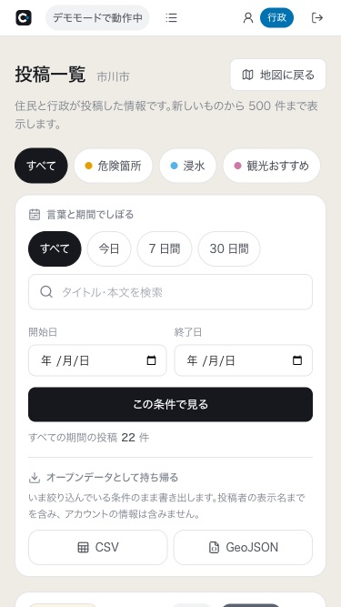

---

## 2-7. ログイン（`/login`）

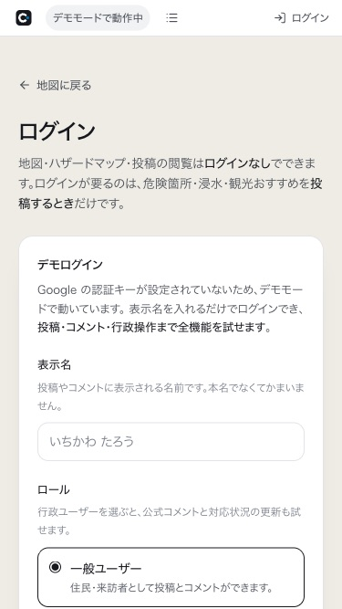

詳しくは [04 章](04-login.md)。

| 部分 | 中身 |
|---|---|
| **地図に戻る** | `/` へ |
| 説明 | 「閲覧はログインなしでできます。ログインが要るのは投稿するときだけです」 |
| **Google でログイン**（鍵がある環境だけ） | Google の同意画面へ |
| **デモログイン** | 表示名＋ロール（＋PIN）でログイン |
| **プライバシーポリシー**へのリンク | 押す直前に読めるところに置いてある |

ログイン中に開くと、代わりに「◯◯ でログイン中」と**ログアウト**ボタンが出る。

---

## 2-8. 出典とライセンス（`/about`）

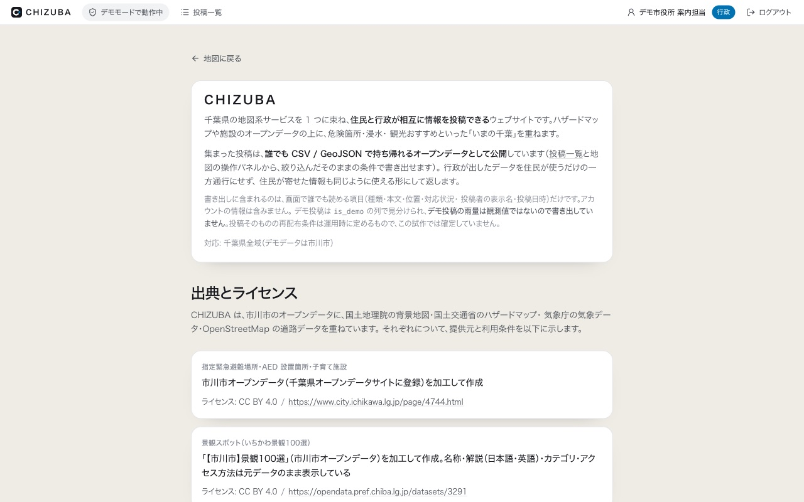

使っているデータと写真の出どころを全部並べたページ。

- **オープンデータの出典**（市川市・千葉県・国土地理院・ハザードマップポータルサイト・気象庁・OSRM / OpenStreetMap）とライセンス
- **景観100選のスポット写真 54 枚**の作者・ライセンス・元ページ
- **デモ投稿の写真 17 枚**の作者・ライセンス・元ページ・撮影地。
  **防災の 7 枚が市外の参考写真である旨**もここに書いてある
- ハザードマップの凡例

---

## 2-9. プライバシーポリシー（`/privacy`）

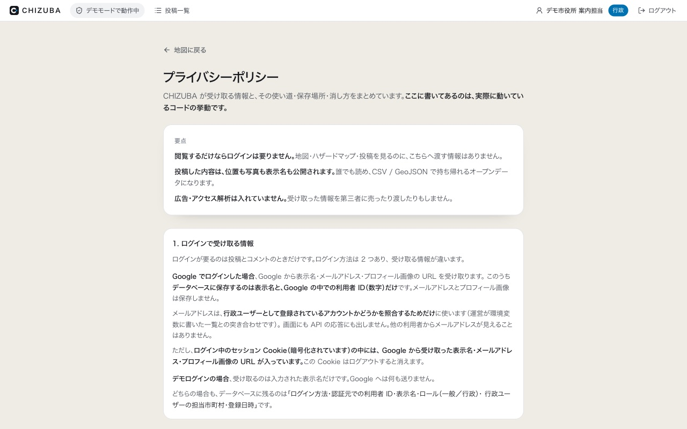

**実装の挙動をそのまま書いたページ。**
受け取る情報・保存する場所・外部へ送るもの・保存期間・問い合わせ先が書いてある。

正直に書いてあること（[13 章](../spec/13-limitations.md)にも同じ内容がある）:

- 暗号化されたセッション Cookie の中には Google のメールアドレスと画像 URL が残る
- **写真は受け取ったまま保存するので Exif（撮影日時・位置情報）が消えない**
- **アカウントを利用者自身で消す画面が無い**
