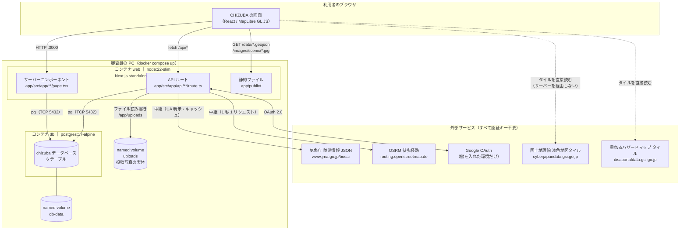
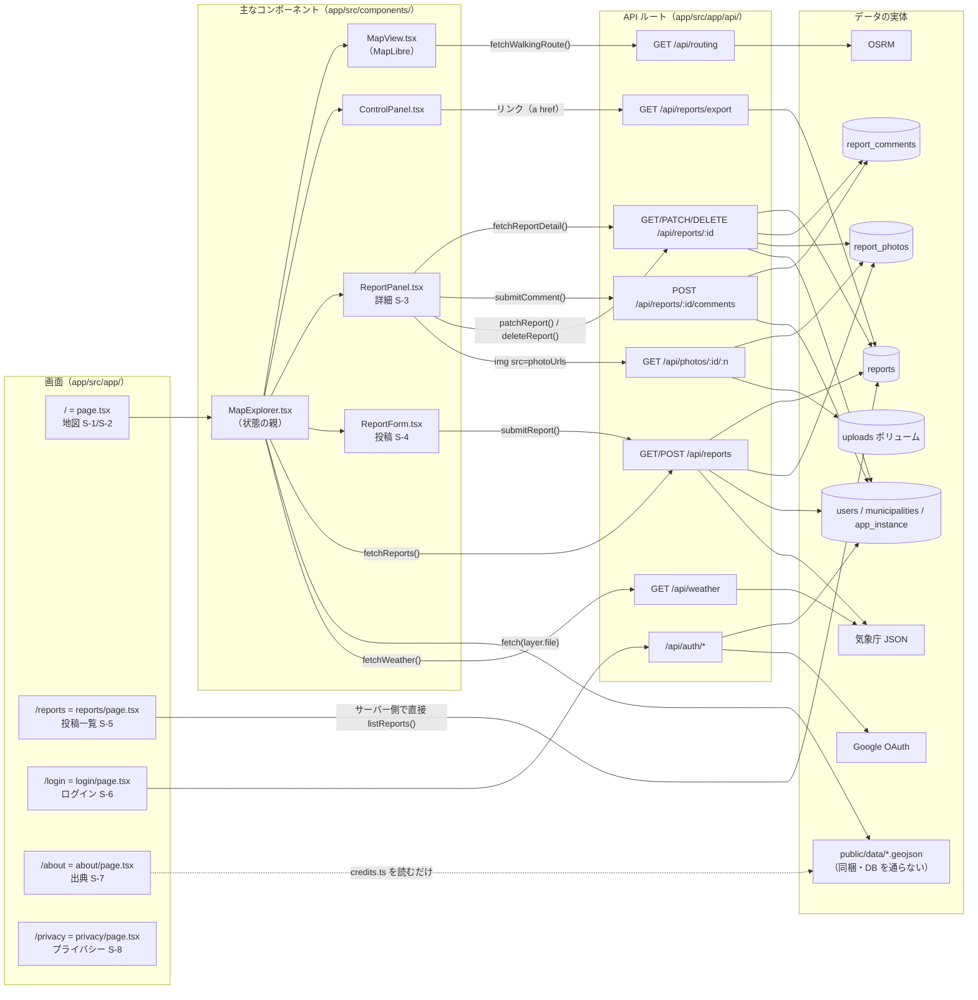
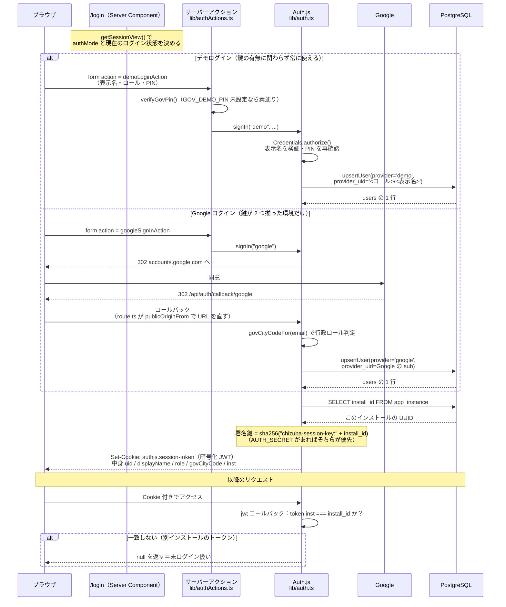
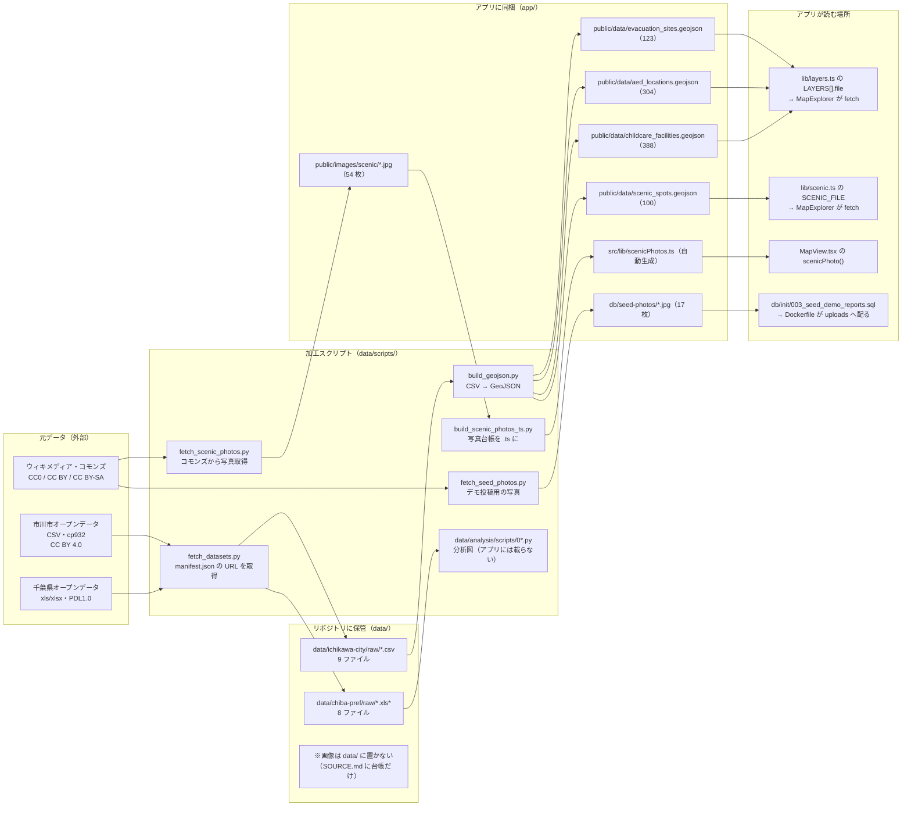
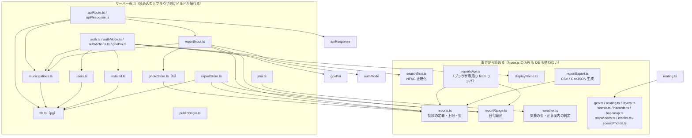

# 01. 全体像と接続図

この章だけで「何が何と繋がっているか」が分かるようにする。個々の中身は次章以降。

---

## 1-1. ひとことで言うと

CHIZUBA は **Next.js のサーバー 1 つと PostgreSQL 1 つ**でできている。
コンテナは 2 個、それ以外に動いているものは無い。

- **地図に載る「行政のデータ」（避難場所・AED・子育て施設・景観100選）は
  GeoJSON ファイルとしてアプリに同梱してあり、データベースを通らない**
- **データベースを使うのは「住民と行政の投稿」だけ**
- 背景地図・ハザードマップ・徒歩経路・気象は**外部サービス**から取る。
  **どれも認証キーが要らない**

この 3 つが CHIZUBA の構造のすべて。以下の図はこれを詳しくしたもの。

---

## 1-2. ①コンテナ間と外部サービスの接続図

読み方の要点。

- **ブラウザが直接叩く外部サービスは「地図タイル 2 種類」だけ**（点線）。
  画像なので中継する意味が薄く、ブラウザのキャッシュがそのまま効く
- **気象庁と OSRM はサーバーが中継する**（実線）。理由は
  「User-Agent を確実に名乗る」「サーバー側でキャッシュする」「1 秒 1 リクエストを守る」の 3 つ
  （`app/src/app/api/routing/route.ts` の冒頭コメント・`app/src/lib/jma.ts` の冒頭コメント）
- **`db` はホストにポートを公開していない**（`app/compose.yaml:91-93` のコメント）。
  審査員のマシンで 5432 番が埋まっていても起動できるようにするため。
  中を見るときは `docker compose exec db psql -U chizuba -d chizuba`

### コンテナの諸元

| | web | db |
|---|---|---|
| イメージ | `node:22-slim`（Docker 公式イメージ・multi-stage で自前ビルド） | `postgres:17-alpine`（Docker 公式イメージ） |
| 定義 | `app/Dockerfile`・`app/compose.yaml:26-65` | `app/compose.yaml:67-93` |
| 公開ポート | ホスト `${CHIZUBA_PORT:-3000}` → コンテナ 3000 | **公開しない**（コンテナ間ネットワークのみ） |
| 起動コマンド | `node server.js`（`Dockerfile:54`） | 公式イメージの entrypoint |
| 実行ユーザー | `node`（`Dockerfile:52`） | 公式イメージの既定 |
| ボリューム | `uploads:/app/uploads` | `db-data:/var/lib/postgresql/data`＋`./db/init:/docker-entrypoint-initdb.d:ro` |
| 起動順 | `db` の healthcheck が通ってから起動（`depends_on.condition: service_healthy`） | 先に起動 |

---

## 1-3. ②画面 → API → データの対応図

「画面のどの部品が、どの API を叩き、どのテーブル／外部サービスに行き着くか」。

**注意すべき例外が 2 つある。**

1. **投稿一覧 `/reports` は API を経由しない。** サーバーコンポーネントなので、
   `app/src/app/reports/page.tsx:85` が `listReports()` を直接呼んで SQL を投げる。
   だから **JavaScript が無効でも一覧・絞り込み・書き出しが動く**（絞り込みはリンクと GET フォーム）
2. **浸水投稿に焼き込む雨量は `/api/weather` を通らない。**
   `POST /api/reports` が `lib/jma.ts` の `observeRainfall()` を直接呼ぶ
   （`app/src/app/api/reports/route.ts:84`）。
   自分自身へ HTTP を投げるとコンテナ内の自ホスト判定に引きずられて壊れやすいため
   （同ファイルの冒頭コメント）

---

## 1-4. ③認証フロー

要点は 3 つ。

- **デモログインは常に登録される。** Google の鍵は「Google を足すかどうか」だけに効く
  （`app/src/lib/auth.ts:90-151` の `providers()`）。
  鍵を入れた公開環境でも、Google アカウントを持たない人が投稿できる
- **セッションはこの DB に縛られている。** JWT に `inst`（インストール ID）を焼き込み、
  毎リクエストで突き合わせる（`auth.ts:183`）。
  だから `docker compose down -v` を打つと**全員ログアウトする**
- **公開 URL は設定値で持たない。** リクエストの `X-Forwarded-Host` →（無ければ）`Host`
  から毎回導く（`app/src/lib/publicOrigin.ts`）。詳細は [06 章](06-auth.md)

---

## 1-5. ④データパイプライン

**元データが直接アプリに入ることはない。** かならず `data/scripts/` のどれかを通る。
理由は「cp932 で読む」「市域外の座標を落とす」「列名を英字キーに直す」という
加工が要るため（`data/scripts/build_geojson.py` の docstring）。詳細は [09 章](09-data-pipeline.md)。

---

## 1-6. 依存の向き（`app/src/lib/` の層）

`lib/` の中は、**ブラウザからも読めるもの**と**サーバー専用**が混在している。
混ぜると壊れる（`pg` はブラウザで動かない）ので、各ファイルの冒頭コメントに
どちら向きかが必ず書いてある。

**このルールを破ると何が起きるか。** たとえば `reports.ts`（ブラウザからも読む）から
`db.ts` を import すると、ブラウザ向けのバンドルに `pg` が入り、ビルドが通っても実行時に壊れる。
だから `reports.ts` の冒頭に「ここに DB や Node.js の API を持ち込まないこと」と明記してある
（`app/src/lib/reports.ts:3-4`）。

---

## 1-7. 画面の重ね順（z-index）

地図の上に UI が重なる画面なので、重ね順は 1 か所で決めてある。
根拠は `app/src/app/globals.css:52-62` と各コンポーネントの `z-*` クラス。

| 重ね | 何 | 定義場所 |
|---|---|---|
| 40 | 通知（Toast） | `MapExplorer.tsx` の Toast を包む div |
| 30 | 投稿フォーム（S-4） | `ReportForm.tsx` の最外 div |
| 20 | 投稿の詳細（S-3） | `ReportPanel.tsx` の `aside` |
| **15** | **MapLibre のポップアップ** | `globals.css`（`.maplibregl-map .maplibregl-popup`） |
| 10 | 操作パネル（ControlPanel） | `ControlPanel.tsx` の `aside` |
| 0 | 地図そのもの | `MapView.tsx` |

**ポップアップの 15 は CSS で後付けしている。** MapLibre のポップアップは既定で
`z-index` を持たず、スマホでは操作パネル（下からせり上がるシート）の裏に完全に隠れていた
（実測。`.agent/progress.md` 2026-08-27 の項）。
