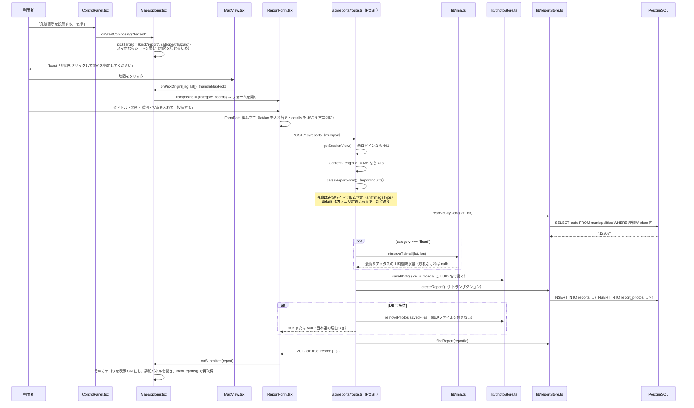

# 04. 機能ごとの処理フロー（F-1〜F-8）

機能の名前と番号は `docs/design/requirements.md`（正本）に合わせてある。
各機能を「**画面のどこを押してから、どのファイルを順に通って、何が返ってくるか**」で追う。

| 番号 | 機能 | 節 |
|---|---|---|
| F-1 | ハザードマップ表示 | [4-1](#4-1-f-1-ハザードマップ表示) |
| F-2 | 老朽化・危険箇所の市民報告 | [4-2](#4-2-f-2-危険箇所の市民報告投稿の作成) |
| F-3 | 雨天時の浸水状況報告 | [4-3](#4-3-f-3-浸水報告雨量の焼き込み) |
| F-4 | 蓄積データ × 雨予報にもとづく注意案内 | [4-4](#4-4-f-4-注意案内) |
| F-5 | 観光マップ | [4-5](#4-5-f-5-観光マップ景観100選) |
| F-6 | 観光おすすめの市民投稿 | [4-6](#4-6-f-6-観光おすすめの投稿) |
| F-7 | 行政からの応答 | [4-7](#4-7-f-7-行政からの応答) |
| F-8 | Google アカウントによるログイン | [4-8](#4-8-f-8-ログイン) |
| 追加 | 徒歩ナビ／検索／期間の絞り込み／書き出し | [4-9](#4-9-その他の機能) |

---

## 4-1. F-1 ハザードマップ表示

**洪水・高潮・津波の浸水想定と、土砂災害警戒区域（急傾斜地の崩壊）を、
背景地図の上に半透明で重ねる。**

### クリックから結果まで

```
① 利用者が操作パネルの「洪水浸水想定区域」の行を押す
   app/src/components/ControlPanel.tsx（HAZARDS.map の中の role="switch" ボタン）
      ↓ onToggleHazard(hazard.id)
② app/src/components/MapExplorer.tsx の toggleHazard()
      ↓ setHazardVisible(prev => ({ ...prev, [id]: !prev[id] }))
③ 新しい hazardVisible が props で MapView へ渡る
④ app/src/components/MapView.tsx の useEffect（「ハザードの重ねの表示切り替え」）
      ↓ map.setLayoutProperty(hazardLayerId(id), "visibility", "visible")
⑤ MapLibre が必要なタイルを取りに行く（**ブラウザから直接**。サーバーは経由しない）
      → https://disaportaldata.gsi.go.jp/raster/01_flood_l2_shinsuishin_data/{z}/{x}/{y}.png
⑥ 凡例が変わる: ControlPanel が visibleHazardLegends(hazardVisible) を呼び、
   表示中のものが使う凡例だけを HazardLegend.tsx に渡す
```

### 4 つのレイヤー（`app/src/lib/hazards.ts` の `HAZARDS`）

| id | ラベル | タイル URL | 凡例 | 初期表示 |
|---|---|---|---|---|
| `flood` | 洪水浸水想定区域 | `…/raster/01_flood_l2_shinsuishin_data/{z}/{x}/{y}.png` | 洪水（6 段階） | **ON** |
| `hightide` | 高潮浸水想定区域 | `…/raster/03_hightide_l2_shinsuishin_data/…` | 津波・高潮（8 段階） | OFF |
| `tsunami` | 津波浸水想定 | `…/raster/04_tsunami_newlegend_data/…` | 津波・高潮（8 段階） | OFF |
| `landslide` | 土砂災害（急傾斜地の崩壊） | `…/raster/05_kyukeishakeikaikuiki/…` | 土砂災害（4 区分） | OFF |

**凡例は 3 系統ある。** 浸水は「深さ」だが、土砂災害は**区域の種別**（特別警戒 / 警戒 ×
指定済 / 指定予定）で、意味そのものが違う。1 つにまとめると必ず誤読されるので、
`visibleHazardLegends()` が**表示中のレイヤーが使う凡例だけ**を返す作りにしてある。
土砂災害だけはラベルが長いので `columns: 1` で縦 1 列に開く（375px で折り返さないため）。

配信元は国土交通省「ハザードマップポータルサイト」。
仕様は <https://disaportal.gsi.go.jp/hazardmap/copyright/opendata.html>
（**2026-09-03 に取得して `01_flood_l2_shinsuishin_data` の記載を確認済み**。[99 章](99-sources.md)）。

### 押さえておくべき挙動

- **不透明度はレイヤーごとに変えられる**（既定 0.6・0.1〜1.0・刻み 0.05）。
  `hazards.ts:HAZARD_OPACITY_*`
- **ズーム 6 より引くと描画しない**（`HAZARD_RENDER_MINZOOM = 6`）。
  想定区域が数ピクセルの染みにしかならないのに、タイルの要求だけが国土交通省の
  サーバーへ飛び続けるのを避けるため
- **`raster-resampling: "nearest"`** を指定している。浸水深は段階ごとの色なので、
  拡大時に中間色を作らせない（`MapView.tsx` のハザードレイヤー定義）
- **想定区域が無い場所はタイルが 404 になる。** MapLibre は黙って描かないだけで、
  エラー処理は要らない。ただし**「色が付いていない＝安全」ではない**ので、
  凡例に注意書きを常時出す（`hazards.ts:HAZARD_CAUTIONS` の 2 本）
- **タイルが 404 でも、その区域が無いとは限らない。** 実測で踏んだ例: 市川市は
  土石流のタイルが 404 だが、**土砂災害警戒区域は 142 区域が指定されている**
  （すべて急傾斜地の崩壊）。**この誤りに気づいて、急傾斜地のレイヤーを足した**のが
  `landslide`。内水（雨水出水）浸水想定は、指定・公表はされているが**タイルが無い**ので
  今の作り（タイルを重ねる方式）では出せない。経緯は `docs/design/requirements.md` §7-1 の訂正
- **土砂災害は既定 OFF。** 指定は斜面のある場所に限られ、市川市では北部に偏っている。
  低地を見ている利用者には「何も塗られないレイヤーが 1 つ増えた」だけに見えるため、
  操作パネルから明示的に ON にしてもらう

---

## 4-2. F-2 危険箇所の市民報告（投稿の作成）

**位置＋写真＋説明を投稿する。** 3 カテゴリ（危険箇所・浸水・観光おすすめ）は
**同じ 1 本の経路**を通る。違いは `category` と `details` だけ。

### クリックから結果まで



### 検証の一覧（`app/src/lib/reportInput.ts` の `parseReportForm`）

| 項目 | 規則 | 違反時 |
|---|---|---|
| `category` | `hazard` / `flood` / `spot` のいずれか | 400「投稿の種類が正しくありません。」 |
| `title` | 1〜60 字（前後の空白を落とす） | 400「タイトルは 60 文字以内にしてください。」 |
| `body` | 1〜1000 字 | 400 同様 |
| `lat` / `lon` | 数値、かつ千葉県の範囲（緯度 34.8〜36.2・経度 139.7〜140.9） | 400「千葉県の範囲から外れています。」 |
| `details` | **カテゴリ定義にあるキーと選択肢だけ**通す。他は捨てる | 400 または黙って除去 |
| `photos` | 3 枚まで／1 枚 5 MB まで／JPEG・PNG・WebP／**先頭バイトも一致** | 400 または 413 |
| リクエスト全体 | 10 MB まで | 413 |
| `city_code` | **クライアントからは受け取らない**（座標から決める） | — |

**なぜ `details` のキーを絞るか。** これがあるおかげで、利用者が
`{"demo": true}` を送っても捨てられ、**デモバッジを詐称できない**
（実測で確認済み。`.agent/progress.md` 2026-08-27 の項）。
同じく `rainfallMm`（サーバーが焼き込む値）も送り付けられない。

---

## 4-3. F-3 浸水報告（雨量の焼き込み）

F-2 と**同じ経路**を通る。違いは 1 か所だけ。

```
app/src/app/api/reports/route.ts:82-86

  const details: Record<string, unknown> = { ...input.details };
  if (input.category === "flood") {
    const observed = await observeRainfall(input.lat, input.lon);
    if (observed) Object.assign(details, toFloodDetails(observed));
  }
```

`observeRainfall()`（`app/src/lib/jma.ts`）がやること:

1. `amedastable.json`（観測所の一覧・**実測 1,286 地点**）と
   `latest_time.txt` → `map/<時刻>.json`（全国の 10 分値）を取る
2. 投稿地点から **20 km 以内**の観測所を距離順に並べる
3. **1 時間降水量が正常な値（品質フラグ 0）で入っている最初の観測所**を採る
4. 見つからなければ `null`

`details` に焼き込まれるのは 4 項目（`app/src/lib/weather.ts` の `FloodObservation`）:

```json
{ "depthLevel": "ankle",
  "rainfallMm": 0.0, "observedAt": "2026-09-03T15:10:00+09:00",
  "amedasStation": "船橋", "amedasDistanceKm": 10.2 }
```

### 押さえておくべき挙動

- **雨量が取れなくても投稿は成功する。** 「現場で投稿できないほうが害が大きい」
  という判断（`api/reports/route.ts:80-81` のコメント）。
  取れなかった投稿は詳細に「投稿時の雨量: 取得できませんでした」と出す
- **市川市にはアメダスが無い。** 最寄りは船橋で、市役所付近から **10.2 km**
  （2026-09-03 に `amedastable.json` を取得して計算した実測値）。
  だから画面には**必ず観測所名と距離を添える**（`weather.ts:formatStation`）
- **この経路は `/api/weather` を通らない。** サーバーが `lib/jma.ts` を直接呼ぶ

### 実測した気象庁 JSON の構造

`amedastable.json` の 1 地点（2026-09-03 取得・千葉の例）:

```json
"45212": { "type": "B", "elems": "11111111",
           "lat": [35, 36.1], "lon": [140, 6.2], "alt": 3,
           "kjName": "千葉", "knName": "チバ", "enName": "Chiba" }
```

**`lat` / `lon` は `[度, 分]` の配列で、小数の度ではない。**
`jma.ts` の `toDegrees()` が `度 + 分/60` に直している。
ここを間違えると全部の距離が壊れる。

---

## 4-4. F-4 注意案内

**「過去にここで浸水報告があった」と「雨の予報が出ている」という
事実 2 つを並べるだけ。** 浸水するとは書かない（理由は [11 章](11-decisions.md#11-6-なぜ予測と言わないか)）。

### 出るまでの流れ

```
① MapExplorer.tsx の useEffect（地図を開いたとき 1 回だけ）
      ↓ fetchWeather(cityCode)  →  GET /api/weather?city=12203
② app/src/app/api/weather/route.ts
      ├ findMunicipality(cityCode) で市の中心座標を得る
      └ Promise.all([observeRainfall(中心), forecastRain(cityCode)])
         → lib/jma.ts が気象庁 JSON を取得（サーバー側でキャッシュ）
③ 返る形（interfaces.md I-6）
      { ok: true, observation: {...} | null, forecast: {...} | null }
④ MapExplorer.tsx で
      floodAlert = buildFloodAlert(weather.forecast, floodHistory)
⑤ 出す条件（lib/weather.ts の buildFloodAlert）を 3 つとも満たすときだけ非 null
      ・forecast が取れている
      ・forecast.rainExpected === true（今後 24 時間の降水確率の最大 ≥ 30%）
      ・過去の浸水報告が 1 件以上ある
⑥ ControlPanel.tsx が FloodAlertCard.tsx を描く
   同時に MapView.tsx が過去の浸水報告に水色の輪（REPORT_ALERT_LAYER）を出す
```

### 期間の絞り込みに引きずらせない

これが F-4 でいちばん重要な仕掛け。

```
app/src/components/MapExplorer.tsx の loadReports()

  if (!hasRange(range)) { setFloodHistory(今の結果から取る); return; }
  const all = await fetchReports({ city: cityCode, categories: ["flood"] });
  if (all.ok) setFloodHistory(all.value.features.map(f => f.properties.createdAt));
```

期間で絞ったせいで「過去に浸水報告はありません」になると**防災の判断を誤らせる**ので、
根拠になる浸水報告だけは**全期間で引き直す**。

### 予報区の解決（実測）

気象庁の予報は市町村単位では出ない。`area.json` の親子をたどる:

```
市川市 "1220300"（class20s・全国 1,805 件）
   → parent "120013" 東葛飾（class15s）
   → parent "120010" 北西部（class10s）  ← これが予報区
   → parent "120000"（発表元＝千葉県）  ← forecast/data/forecast/120000.json
```

2026-09-03 に `area.json` を取得してたどった結果。だから
**画面には必ず予報区名（「北西部」）を出す**（`FloodAlertCard.tsx`）。

`forecast/data/forecast/120000.json` の実測（2026-09-03 11:00 発表）:

| timeSeries | 中身 | コードで使う場所 |
|---|---|---|
| `[0]` | `weatherCodes` / `weathers` / `winds` / `waves` | 天気の文（そのまま引用） |
| `[1]` | `pops`（降水確率） | 今後 24 時間の最大値 |
| `[2]` | `temps`（気温・観測所コード 45212） | 使わない |

**番号は決め打ちしていない。** `pops` を持つ時系列を `find` で探す
（`jma.ts:forecastRain`）。気象庁側の並びが変わっても壊れないようにするため。

---

## 4-5. F-5 観光マップ（景観100選）

**市川市が選んだ 100 か所の景観スポット**を地図に載せ、日英の解説と写真を出す。

```
① MapModeTabs.tsx で「観光」を押す
      ↓ onChange("tourism")
② MapExplorer.tsx の changeMode()
      ├ setVisible(layerVisibilityFor("tourism"))     → 施設 3 本を OFF
      ├ setHazardVisible(hazardVisibilityFor(...))    → ハザードを全部 OFF
      ├ setReportVisible(reportVisibilityFor(...))    → spot だけ ON
      ├ setScenicVisible(true)
      └ URL に ?mode=tourism を残す（history.replaceState）
      ※ 地図そのものは作り直さない
③ MapView.tsx の useEffect が
      map.setLayoutProperty(SCENIC_POINT_LAYER, "visibility", "visible")
④ 点を押す → buildScenicPopup() が DOM を組み立てる
      ├ scenicPhoto(name) で写真があれば先頭に帯（作者名・ライセンスを重ねる）
      ├ カテゴリのタグ（1 件が最大 3 つ）
      ├ 日本語 / English の切り替えボタン
      └ 下に固定の「ここへナビ」
```

### 実測したデータの中身（`app/public/scenic_spots.geojson`）

| 項目 | 実測値 |
|---|---|
| 地点数 | **100** |
| プロパティ | `name` `nameEn` `description` `descriptionEn` `access` `address` `area` `tel` `url` `categories` `categoryPrimary` |
| カテゴリの内訳 | まち並み **65** / 自然 **39** / 歴史・文化 **26** / 生活風景 **14**（1 件が複数持つので合計は 100 を超える） |
| `access` を持つ件数 | **73**（100 件中） |
| 写真が付く件数 | **54**（`app/public/images/scenic/` の実ファイル数） |

### 罠：MapLibre は配列プロパティを文字列に畳む

`categories` は GeoJSON では配列だが、MapLibre のクリックイベントから受け取ると
JSON 文字列になっている。だから `lib/scenic.ts` の `scenicCategories()` が
**配列でも文字列でも同じ配列に直す**。色分けには畳まれない
`categoryPrimary`（文字列）を使う。

---

## 4-6. F-6 観光おすすめの投稿

**F-2 とまったく同じ経路。** カテゴリが `spot` になり、
`details` の項目が `spotType`（景観／お土産／飲食／その他）に変わるだけ。

これが「3 種類を 1 テーブル・1 API・1 フォームに統一」の効き目で、
**`ReportForm.tsx` にカテゴリ固有のコードは 1 行も無い**
（入力欄は `reportCategoryDef(category).detailFields` から組み立てる）。

観光モードでは操作パネルの投稿ボタンが「観光おすすめを投稿する」1 つになる
（`lib/mapModes.ts` の `MAP_MODES[1].postable = ["spot"]`）。

---

## 4-7. F-7 行政からの応答

**2 つの操作がある。どちらも `PATCH /api/reports/:id` か
`POST /api/reports/:id/comments` の 1 本に載っている。**

### ① 対応状況の更新（4 段階）

```
① ReportPanel.tsx が canUpdateStatus(user, report) を見て
   ReportStatusControl.tsx を出すか決める（**表示の出し分けだけ**）
② 行政ユーザーが「対応中」を押す
      ↓ patchReport(report.id, { status: "in_progress" })
③ PATCH /api/reports/:id（app/src/app/api/reports/[id]/route.ts）
      ├ getSessionView() → 未ログインなら 401
      ├ findReportOwnership(id) で投稿の持ち主・市町村・カテゴリを引く
      ├ parseReportPatch() で status の値を検証
      ├ **権限判定**: user.role === "gov" && user.govCityCode === owner.cityCode
      │   → 満たさなければ 403「この投稿の対応状況を変更する権限がありません。」
      ├ updateReport(id, patch) → UPDATE reports SET status = …, updated_at = now()
      └ findReport(id) で最新の姿を返す
④ ReportPanel.tsx の handleUpdated() が表示を差し替え、onChanged() で
   地図のピンと一覧も読み直す
```

4 段階は `lib/reports.ts` の `REPORT_STATUSES`:

| id | ラベル | 説明（画面に出る） |
|---|---|---|
| `open` | 未対応 | まだ確認していない |
| `ack` | 受付 | 受け付けた。確認はこれから |
| `in_progress` | 対応中 | 現地の確認・工事などを進めている |
| `done` | 対応済 | 対応が終わった |

### ② 公式コメント

`POST /api/reports/:id/comments` で、**`isOfficial` はクライアントから受け取らない**。

```
app/src/app/api/reports/[id]/comments/route.ts:46-47

  const isOfficial =
    user.role === "gov" && user.govCityCode === found.properties.cityCode;
```

**市川市の職員が船橋市の投稿に公式回答を出せない。** ここを信用すると
一般ユーザーが行政を騙れるので、サーバーが投稿者のロールを見て決める。

### ③ 投稿者本人による本文の編集（同じ PATCH）

```
app/src/app/api/reports/[id]/route.ts:87-89

  if (patchTouchesContent(patch) && user.id !== owner.authorId) {
    return apiFail("この投稿を変更する権限がありません。", 403);
  }
```

**行政ユーザーでも他人の本文は書き換えられない。**
行政の言い分はコメントとして残す（書き換えると誰が書いたか分からなくなるため）。

編集できるのは**タイトル・説明・カテゴリ固有の項目**だけ。**位置と写真は変えられない**
（位置を後から動かせると写真と現場が食い違う。`ReportEditForm.tsx` の冒頭コメント）。

### `details` は置き換えず重ねる

```
app/src/lib/reportStore.ts の updateReport()
  sets.push(`details = details || $${params.length}::jsonb`);
```

丸ごと置き換えると、**浸水投稿の `rainfallMm`（サーバーが焼き込んだ値）が
本文を直すたびに消える**。だから PostgreSQL の `||` 演算子で重ねる。

---

## 4-8. F-8 ログイン

[06 章](06-auth.md)に詳しく書いた。ここでは要点だけ。

- **鍵が無い環境ではデモログインだけ**、鍵が 2 つ揃うと**Google が足される**。
  デモログインは消えない（`app/src/lib/auth.ts:90-151`）
- デモログインは表示名とロール（一般／行政）を自分で選ぶ。
  公開環境では `GOV_DEMO_PIN` を設定して行政ロールだけ PIN で守れる
- **閲覧はログイン不要。** ログインが要るのは投稿・コメント・行政操作だけ

---

## 4-9. その他の機能

`requirements.md` §3-4 で足したもの。F 番号は付いていない。

### ① 徒歩ナビ

```
① 地図のポップアップの「ここへナビ」（または操作パネルの「現在地から最寄りの地点へ」）
      ↓ MapExplorer.tsx の handleNavigateTo / handleNavigateNearest
② 出発地点が未確定なら currentPosition()（ブラウザの Geolocation API）
      失敗したら「地図をクリックして出発地点を指定してください」に切り替える
③ fetchWalkingRoute(from, destination)（lib/routing.ts）
      ↓ GET /api/routing?from=経度,緯度&to=経度,緯度
④ app/src/app/api/routing/route.ts
      ├ waitForSlot() で**前回の送信から 1.1 秒**空ける（利用規約の 1 秒 1 リクエスト）
      ├ OSRM へ GET（User-Agent 明示・8 秒でタイムアウト）
      └ 成功なら { ok:true, distanceMeters, durationSeconds, geometry }
⑤ 失敗したら lib/routing.ts が**直線距離 ÷ 4.8 km/h** の概算に落とし、
   estimated: true を立てる（画面に「概算」と出る）
⑥ MapView.tsx が線を引き、fitBounds で経路全体を画面に収める
   ControlPanel.tsx が RouteCard.tsx で距離と所要時間を出す
```

**「最寄り」は直線距離で決めている**（`lib/geo.ts:nearestCandidate`）。
徒歩経路の長さで並べ替えると候補の数だけ OSRM を叩くことになり、
1 秒 1 リクエストの制限に触れるため。

OSRM の実レスポンス（2026-09-03 実測・市役所付近 → 250 m 先）:

```json
{ "code": "Ok",
  "routes": [{ "distance": 669.2, "duration": 535.2,
               "geometry": { "type": "LineString", "coordinates": [[139.931193, 35.722581], …35 点] } }] }
```

### ② キーワード検索

**投稿はサーバーで、景観スポットはブラウザで探す。**

```
① SearchBox.tsx に文字を打つ → MapExplorer.tsx の query が変わる
② 350 ms 待ってから appliedQuery に反映（1 文字ごとにサーバーへ投げない）
③ 投稿: fetchReports({ q: appliedQuery }) → GET /api/reports?q=…
      サーバー側 SQL（lib/reportStore.ts の whereFor）:
        lower(normalize(r.title, NFKC)) LIKE $n ESCAPE '\'
          OR lower(normalize(r.body,  NFKC)) LIKE $n ESCAPE '\'
④ 景観スポット: 読み込み済みの GeoJSON から searchMatches() で手元で探す
      （100 件しかないのでサーバーへ往復する必要がない）
⑤ 当たったものだけ地図に残り、下に候補一覧（最大 8 件）が出る
```

**両側を NFKC 正規化＋小文字化してから突き合わせる**ので、
「ｱﾝﾀﾞｰﾊﾟｽ」と打っても「アンダーパス」に当たる。
PostgreSQL の `normalize(text, NFKC)` は 13 以降の組み込み関数
（[PostgreSQL 17 の文字列関数](https://www.postgresql.org/docs/17/functions-string.html)）。
`%` や `_` は `escapeLike()` で打ち消す。

### ③ 期間の絞り込み（浸水実績アーカイブ）

日付は **JST の暦日**で扱う。SQL は:

```sql
r.created_at >= ($n::date::timestamp AT TIME ZONE 'Asia/Tokyo')
r.created_at <  (($n::date + 1)::timestamp AT TIME ZONE 'Asia/Tokyo')
```

**`::timestamp` を省くと壊れる。** `date AT TIME ZONE …` は
date → timestamptz の暗黙キャストに解決され、意味が逆向き（「timestamptz を
そのゾーンのローカル時刻に直す」）になる。境目が 9 時間ずれ、単日の指定が
1 件も引けなくなる。PostgreSQL 17 で実測した結果が `reportStore.ts` の
コメントに残っている。

### ④ CSV / GeoJSON の書き出し

```
① 操作パネルまたは /reports の「オープンデータとして持ち帰る」の
   CSV / GeoJSON のリンク（<a href> なので **JavaScript が無くても動く**）
      ↓ exportHref({ format, city, from, to, category, q })
② GET /api/reports/export?format=csv&city=12203&…
③ app/src/app/api/reports/export/route.ts
      ├ resolveListQuery()（**一覧と同じ読み方**。別々に書くと画面と中身が食い違う）
      ├ limit を明示していなければ 1000（画面用の 500 ではなく上限）に上げる
      ├ listReports(filter)
      └ toCsv() または toGeoJson()（lib/reportExport.ts）
④ Content-Disposition: attachment; filename="chizuba-reports-12203-20260903.csv"
```

**出すもの／出さないもの**（`lib/reportExport.ts` の冒頭コメント）:

| 出す | 出さない |
|---|---|
| id・カテゴリ・タイトル・本文・座標・市町村コード・対応状況・**投稿者の表示名**・投稿日時・写真枚数・コメント数・公式回答の有無・カテゴリ固有の項目・`is_demo` | **ユーザー ID・メールアドレス・provider_uid**・**デモ投稿の雨量** |

デモ投稿の雨量を出さないのは、**観測値ではないものを観測値の列に入れない**ため。
受け取った人には見分けが付かなくなる。

CSV は **UTF-8 BOM ＋ CRLF ＋ RFC 4180**
（[RFC 4180](https://www.rfc-editor.org/rfc/rfc4180.txt)）。
さらに**利用者が書いた文字列が `=` `+` `-` `@` で始まるとき先頭に `'` を足す**。
表計算ソフトが本文を数式として実行するのを止めるため（中身は変えない）。

GeoJSON は **RFC 7946**（[RFC 7946](https://www.rfc-editor.org/rfc/rfc7946.txt)）。
座標は `[経度, 緯度]`・小数 6 桁、`bbox` は 5 章の規定どおり `[西, 南, 東, 北]`、
`crs` メンバーは付けない（RFC 7946 は WGS84 固定のため）。
