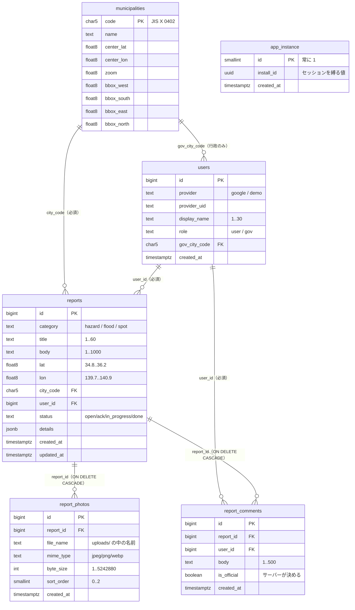

# 05. データベース

**正本は `app/db/init/001_schema.sql`（138 行）。** この章はそれを転記して説明を足したもの。
食い違ったら SQL を勝たせる。

- 種類: **PostgreSQL 17**（`postgres:17-alpine`・Docker 公式イメージ）
- **PostGIS は入れていない。** 位置は `double precision` の緯度経度 2 列
- **ORM もマイグレーションツールも入れていない。** SQL は `pg`（node-postgres）で直接投げる
- テーブル **5 つ**・索引 **6 つ**（主キーと UNIQUE の自動索引を除く）

---

## 5-1. テーブルの関係



**`app_instance` はどこからも参照されない孤立したテーブル。**
外部キーではなく、**JWT に焼き込む値の出どころ**として使う（[06 章](06-auth.md)）。

---

## 5-2. `app_instance` — このインストールの識別子

```sql
CREATE TABLE app_instance (
    id         smallint    PRIMARY KEY DEFAULT 1 CHECK (id = 1),
    install_id uuid        NOT NULL DEFAULT gen_random_uuid(),
    created_at timestamptz NOT NULL DEFAULT now()
);
INSERT INTO app_instance (id) VALUES (1);
```

| カラム | 型 | 制約 | 意味 |
|---|---|---|---|
| `id` | `smallint` | PK・`CHECK (id = 1)` | **行は常に 1 行だけ**。CHECK で 2 行目を作れなくしてある |
| `install_id` | `uuid` | NOT NULL・既定 `gen_random_uuid()` | この CHIZUBA を識別する乱数。**JWT の署名鍵の素**になる |
| `created_at` | `timestamptz` | NOT NULL | 作られた時刻 |

**なぜ要るか。** JWT の中身は `uid`（`users.id`）だけで、`users.id` はただの連番。
DB を作り直せば同じ番号が別人に割り当たる。しかも Cookie はポートを区別しないので、
同じ `localhost` の別インスタンス同士でもトークンが届く。

**実測（2026-08-27）**: 別 DB で発行した「行政ユーザー」のトークンを、
作り直した直後の DB に持ち込んだら**そのまま行政操作（対応状況の更新）が通った**。
トークンの `uid = 9` はその DB に存在すらしていなかった。
この穴を塞ぐために入れたのがこのテーブル（`app/src/lib/installId.ts` の冒頭コメント）。

`gen_random_uuid()` は PostgreSQL 13 以降の組み込み関数で、拡張は要らない。

---

## 5-3. `municipalities` — 市町村マスタ

```sql
CREATE TABLE municipalities (
    code       char(5)          PRIMARY KEY CHECK (code ~ '^[0-9]{5}$'),
    name       text             NOT NULL,
    center_lat double precision NOT NULL,
    center_lon double precision NOT NULL,
    zoom       double precision NOT NULL DEFAULT 12,
    bbox_west  double precision NOT NULL,
    bbox_south double precision NOT NULL,
    bbox_east  double precision NOT NULL,
    bbox_north double precision NOT NULL,
    CONSTRAINT municipalities_bbox_order
        CHECK (bbox_west < bbox_east AND bbox_south < bbox_north)
);
```

| カラム | 型 | 制約 | 意味 |
|---|---|---|---|
| `code` | `char(5)` | PK・数字 5 桁 | JIS X 0402 の市町村コード。市川市は `12203`（[全国地方公共団体コード](https://www.soumu.go.jp/denshijiti/code.html)） |
| `name` | `text` | NOT NULL | 「市川市」 |
| `center_lat`/`center_lon`/`zoom` | `double precision` | NOT NULL | 地図の初期表示。`lib/basemap.ts` の値と一致させる |
| `bbox_west`/`south`/`east`/`north` | `double precision` | NOT NULL・順序 CHECK | 市域のおおよその箱。**投稿の座標から市町村を決める**のに使う |

**入っているのは 1 行だけ**（`002_seed_municipalities.sql`）:

```sql
('12203', '市川市', 35.7226, 139.9312, 12.4, 139.84, 35.60, 140.02, 35.82)
```

**千葉県全域対応の建付けはここ。** 市町村を 1 つ増やす作業＝このテーブルに 1 行足すだけで、
コードは変えなくてよい。座標をコードに書かないのはそのため
（`002_seed_municipalities.sql:6-7` のコメント）。

`bbox_*` の値は `data/scripts/build_geojson.py` の `BBOX_LAT`/`BBOX_LON` と同じ
（`BBOX_LAT = (35.60, 35.82)` / `BBOX_LON = (139.84, 140.02)`）。

**論理設計との違い**: `requirements.md` §5 では `bbox` を 1 項目と書いてあるが、
物理スキーマは SQL で範囲比較をそのまま書けるよう **4 列に分けてある**。
物理はこのファイルが正本（`001_schema.sql:48-50` のコメント）。

---

## 5-4. `users` — ログインした人

```sql
CREATE TABLE users (
    id            bigint GENERATED ALWAYS AS IDENTITY PRIMARY KEY,
    provider      text        NOT NULL CHECK (provider IN ('google', 'demo')),
    provider_uid  text        NOT NULL,
    display_name  text        NOT NULL CHECK (char_length(display_name) BETWEEN 1 AND 30),
    role          text        NOT NULL DEFAULT 'user' CHECK (role IN ('user', 'gov')),
    gov_city_code char(5)     REFERENCES municipalities (code),
    created_at    timestamptz NOT NULL DEFAULT now(),
    UNIQUE (provider, provider_uid),
    CONSTRAINT users_gov_requires_city
        CHECK (role <> 'gov' OR gov_city_code IS NOT NULL)
);
```

| カラム | 型 | 制約 | 意味・注意 |
|---|---|---|---|
| `id` | `bigint` | PK・自動連番 | `pg` は bigint を**文字列で返す**ので、コード側で `Number()` に直している（`users.ts:54`） |
| `provider` | `text` | `google` / `demo` | どちらの入り口から入ったか |
| `provider_uid` | `text` | NOT NULL | Google なら `account.providerAccountId`（Google の `sub`）、デモなら `<ロール>/<表示名>`。**画面にもレスポンスにも出さない** |
| `display_name` | `text` | 1〜30 字 | 画面に出る唯一の識別子 |
| `role` | `text` | `user` / `gov` | 一般／行政 |
| `gov_city_code` | `char(5)` | `municipalities` への外部キー | **行政ユーザーが担当する市町村**。他市の投稿を操作させない鍵 |
| `created_at` | `timestamptz` | NOT NULL | |

**制約の意味を 2 つ。**

- `UNIQUE (provider, provider_uid)` — 同じ人が入り直しても行が増えない。
  `upsertUser()` はこれを使って `ON CONFLICT … DO UPDATE` する（`lib/users.ts:35-41`）。
  デモログインは `<ロール>/<表示名>` を uid にするので、
  **同じ表示名 × 同じロールで入り直すと同じユーザーになる**
- `users_gov_requires_city` — **行政ユーザーは必ず担当市町村を持つ。**
  これが無いと `gov_city_code = NULL` の行政ユーザーができ、権限判定の
  `user.govCityCode === report.cityCode` が意図せず通る／通らないことになる

デモ投稿のシードは `provider_uid` を `seed:` で始めている
（`seed:resident:01`〜`seed:gov:02`）。デモログインが作る `<ロール>/<表示名>` と
**形が衝突しないようにするため**（`003_seed_demo_reports.sql:32-34`）。

---

## 5-5. `reports` — 投稿（3 カテゴリ共通）

```sql
CREATE TABLE reports (
    id         bigint GENERATED ALWAYS AS IDENTITY PRIMARY KEY,
    category   text             NOT NULL CHECK (category IN ('hazard', 'flood', 'spot')),
    title      text             NOT NULL CHECK (char_length(title) BETWEEN 1 AND 60),
    body       text             NOT NULL CHECK (char_length(body) BETWEEN 1 AND 1000),
    lat        double precision NOT NULL CHECK (lat BETWEEN 34.8 AND 36.2),
    lon        double precision NOT NULL CHECK (lon BETWEEN 139.7 AND 140.9),
    city_code  char(5)          NOT NULL REFERENCES municipalities (code),
    user_id    bigint           NOT NULL REFERENCES users (id),
    status     text             NOT NULL DEFAULT 'open'
                                CHECK (status IN ('open', 'ack', 'in_progress', 'done')),
    details    jsonb            NOT NULL DEFAULT '{}'::jsonb,
    created_at timestamptz      NOT NULL DEFAULT now(),
    updated_at timestamptz      NOT NULL DEFAULT now()
);
```

| カラム | 型 | 制約 | 意味・注意 |
|---|---|---|---|
| `id` | `bigint` | PK・自動連番 | |
| `category` | `text` | 3 値 | **`app/src/lib/reports.ts` の `REPORT_CATEGORIES` と同じ 3 つ。片方だけ増やさない** |
| `title` | `text` | 1〜60 字 | `TITLE_MAX_LENGTH = 60` と同じ値 |
| `body` | `text` | 1〜1000 字 | `BODY_MAX_LENGTH = 1000` と同じ値 |
| `lat` | `double precision` | 34.8〜36.2 | **千葉県のおおよその範囲**。`CHIBA_BOUNDS` と同じ値 |
| `lon` | `double precision` | 139.7〜140.9 | 同上 |
| `city_code` | `char(5)` | NOT NULL・外部キー | **クライアントからは受け取らない。** サーバーが `resolveCityCode(lat, lon)` で bbox と突き合わせて決める |
| `user_id` | `bigint` | NOT NULL・外部キー | **API のレスポンスには載せない**（誰の投稿かは表示名でしか外に出さない） |
| `status` | `text` | 4 値・既定 `open` | 変えられるのは担当市町村の行政ユーザーだけ |
| `details` | `jsonb` | NOT NULL・既定 `{}` | カテゴリ固有の項目（下記 5-8） |
| `created_at` / `updated_at` | `timestamptz` | NOT NULL | **PATCH で `updated_at` を更新する**。表示は JST に直す |

**削除は物理削除。** 論理削除フラグは持たない（`001_schema.sql:14`）。

### 索引（5 本）

```sql
CREATE INDEX reports_lat_idx        ON reports (lat);
CREATE INDEX reports_lon_idx        ON reports (lon);
CREATE INDEX reports_city_code_idx  ON reports (city_code);
CREATE INDEX reports_category_idx   ON reports (category);
CREATE INDEX reports_created_at_idx ON reports (created_at DESC);
```

一覧の WHERE 句（`lib/reportStore.ts` の `whereFor`）が
`city_code = $1 AND lon BETWEEN … AND lat BETWEEN … AND category = ANY(…) AND status = ANY(…)`、
ORDER BY が `created_at DESC, id DESC` なので、それに合わせてある。

**キーワード検索には索引が効かない。** `lower(normalize(title, NFKC)) LIKE '%…%'`
は前方一致でないうえ関数を通すので、既存の B-tree では使えない
（式インデックスや `pg_trgm` は入れていない）。投稿が数万件規模になったら
問題になるが、いまの規模（デモ 22 件）では実測で体感差が無い。
詳しくは [13 章](13-limitations.md)。

---

## 5-6. `report_photos` — 投稿の写真

```sql
CREATE TABLE report_photos (
    id         bigint GENERATED ALWAYS AS IDENTITY PRIMARY KEY,
    report_id  bigint      NOT NULL REFERENCES reports (id) ON DELETE CASCADE,
    file_name  text        NOT NULL,
    mime_type  text        NOT NULL
                           CHECK (mime_type IN ('image/jpeg', 'image/png', 'image/webp')),
    byte_size  integer     NOT NULL CHECK (byte_size > 0 AND byte_size <= 5242880),
    sort_order smallint    NOT NULL DEFAULT 0 CHECK (sort_order BETWEEN 0 AND 2),
    created_at timestamptz NOT NULL DEFAULT now(),
    UNIQUE (report_id, sort_order)
);
```

| カラム | 制約 | 意味 |
|---|---|---|
| `report_id` | **`ON DELETE CASCADE`** | 投稿を消すと写真の行も自動で消える。**実体（ファイル）は API が別途消す** |
| `file_name` | NOT NULL | `uploads/` の中の名前。**UUID ＋ 拡張子**（投稿された名前は使わない） |
| `mime_type` | 3 値 | `ALLOWED_PHOTO_TYPES` と同じ |
| `byte_size` | 1〜**5242880** | ちょうど 5 MiB。`PHOTO_MAX_BYTES = 5 * 1024 * 1024` と同じ値 |
| `sort_order` | 0〜2・`UNIQUE (report_id, sort_order)` | **1 投稿 3 枚まで**をここで担保する。並び順は重複しない |

**API の URL は 1 始まり**（`/api/photos/<投稿 ID>/<1..3>`）だが、
**DB の `sort_order` は 0 始まり**。変換は 2 か所:

- 出すとき: `reportStore.ts:toProperties` の `photoUrl(id, order + 1)`
- 取るとき: `reportStore.ts:findPhoto` の `sort_order = $2` に `index - 1`

**写真の実体を DB に入れない理由**は [11 章](11-decisions.md#11-4-なぜ写真を-db-でなくファイルに置くか)。

---

## 5-7. `report_comments` — コメント

```sql
CREATE TABLE report_comments (
    id          bigint GENERATED ALWAYS AS IDENTITY PRIMARY KEY,
    report_id   bigint      NOT NULL REFERENCES reports (id) ON DELETE CASCADE,
    user_id     bigint      NOT NULL REFERENCES users (id),
    body        text        NOT NULL CHECK (char_length(body) BETWEEN 1 AND 500),
    is_official boolean     NOT NULL DEFAULT false,
    created_at  timestamptz NOT NULL DEFAULT now()
);
CREATE INDEX report_comments_report_id_idx ON report_comments (report_id, created_at);
```

| カラム | 制約 | 意味 |
|---|---|---|
| `report_id` | `ON DELETE CASCADE` | 投稿を消すとコメントも消える |
| `body` | 1〜500 字 | `COMMENT_MAX_LENGTH = 500` と同じ |
| `is_official` | 既定 `false` | **行政の公式回答か。クライアントからは受け取らない**（サーバーが投稿者のロールと担当市町村を見て決める） |

索引 `(report_id, created_at)` は `listComments()` の
`WHERE report_id = $1 ORDER BY created_at, id` に合わせてある。

**コメントは編集も削除もできない**（そのための API が無い）。[13 章](13-limitations.md)参照。

---

## 5-8. `details`（jsonb）の仕様

**カテゴリ固有の項目を 1 テーブルに収めるための逃げ場。**
`app/src/lib/reports.ts` の `REPORT_CATEGORIES[].detailFields` が正本で、
**ここに無いキーはサーバーが捨てる**（`reportInput.ts` の `pickDetails`）。

### ① 利用者が選べるキー

| カテゴリ | キー | 選べる値（`value` → 画面の表示） |
|---|---|---|
| `hazard` | `hazardType` | `road`→道路・歩道／`light`→照明・電柱／`bank`→護岸・水路／`playground`→公園・遊具／`other`→その他 |
| `flood` | `depthLevel` | `ankle`→足首まで／`knee`→膝まで／`waist`→腰まで |
| `spot` | `spotType` | `scenery`→景観／`souvenir`→お土産／`food`→飲食／`other`→その他 |

### ② サーバーだけが入れるキー（浸水投稿）

| キー | 型 | 入れるところ |
|---|---|---|
| `rainfallMm` | number | `POST /api/reports` が `observeRainfall()` の結果から |
| `observedAt` | string（JST の ISO 8601） | 同上 |
| `amedasStation` | string | 同上 |
| `amedasDistanceKm` | number | 同上 |

**クライアントが送っても捨てられる**（`pickDetails` が `detailFields` にあるキーしか通さない）。

### ③ シードだけが持つキー

| キー | 型 | 意味 |
|---|---|---|
| `demo` | `true` | **デモ投稿の印。** `003_seed_demo_reports.sql` が入れる。利用者は付けられない |

デモ投稿の `rainfallMm` は**ダミー値**で、観測所も観測時刻も持たない。
だから `readFloodObservation()` は `null` を返し、画面は「デモ値」としてしか出さない
（`components/FloodRainfall.tsx`）。**書き出し（CSV / GeoJSON）にも含めない。**

### 実例（デモ投稿から）

```json
{"hazardType":"road","demo":true}
{"depthLevel":"knee","demo":true,"rainfallMm":32.0}
{"spotType":"souvenir","demo":true}
```

利用者が実際に投稿した浸水報告なら:

```json
{"depthLevel":"ankle","rainfallMm":3.5,"observedAt":"2026-09-03T15:10:00+09:00",
 "amedasStation":"船橋","amedasDistanceKm":10.2}
```

### `details` を検索条件に使わない

`001_schema.sql:96-97` に明記してある。使いたくなったら**列に昇格させる**約束。
jsonb に索引を張ると、検索条件が増えるたびに索引の設計が複雑になるため。

---

## 5-9. 初期データ（デモ）の中身

`app/db/init/003_seed_demo_reports.sql` が入れるもの。**ボリュームが空のときだけ**流れる。

| 種類 | 件数 | 内訳 |
|---|---|---|
| デモユーザー | 7 | 住民 5（`デモ住民A`〜`E`）・行政 2（`デモ市役所 道路担当`・`デモ市役所 観光担当`） |
| 投稿 | **22** | 危険箇所 7（うち行政 1）・浸水 5（うち行政 1）・観光おすすめ 10（うち行政 1） |
| 写真 | 17 | 防災の**参考写真** 6（**市外で撮影**）・観光 11 |
| コメント | 6 | 行政の公式回答 3・住民 3 |

**守っていること**（`003_seed_demo_reports.sql:15-25`。変更するときも崩さない）:

1. **実際の被害を特定の場所に結び付けない。** 2026 年 8 月の千葉豪雨をはじめ、
   実際に起きた災害の被害を「ここで起きた」と書いた投稿は 1 件も無い
2. **本文の末尾に必ずデモである断り書きを入れる**（画面のバッジと二重で示す）
3. **浸水投稿の雨量はダミー値**（`"demo": true` を併記）
4. **写真は再利用が許されたものだけ**。防災の写真は市外の参考写真

投稿日時は `now() - <時間> * interval '1 hour'` の相対指定なので、
**審査員がいつ起動しても「最近の投稿」に見える**。最大でも 10 日前まで。
浸水の 5 件は 3 つの「雨のあった日」（約 1 日前 3 件・4 日前 1 件・9 日前 1 件）に
散らしてある。全部が同じ日に固まっていると期間の絞り込みを試せないため。

---

## 5-10. 接続とトランザクション

`app/src/lib/db.ts`。

| 設定 | 値 | 理由 |
|---|---|---|
| プールの上限 | **10** 接続 | `db.ts:40` |
| 接続待ちの上限 | **5 秒** | compose の healthcheck 通過後に起動するので短くてよい |
| 1 クエリの上限 | **10 秒**（`statement_timeout`） | 画面を固めないための保険 |
| アイドル接続の寿命 | 30 秒 | |

- **接続そのものの失敗だけ** `DbUnavailableError` に包む（`isConnectionError`）。
  SQL の書き間違いや制約違反はそのまま投げて、開発中に気づけるようにする
- API ルートは `withDb()`（`lib/apiRoute.ts`）で受けて **503** に変換する。
  地図と静的レイヤーは出したまま、投稿だけ空になる
- **トランザクションを使うのは投稿の作成だけ**（`withTransaction`）。
  `reports` に 1 行 ＋ `report_photos` に n 行を「まとめて成立させる」ため。
  失敗すれば ROLLBACK されるので、呼び出し側は保存済みの写真の実体を消すだけでよい

---

## 5-11. スキーマを変えるときの手順

```bash
# 1. app/db/init/*.sql を直す
# 2. ボリュームごと作り直す（投稿写真とログイン状態も消える）
cd app && docker compose down -v && docker compose up
```

`db/init/` はデータボリュームが空のときだけ流れるので、
**SQL を直しただけでは反映されない。** 「変えたのに反映されない」の原因はたいていこれ。

同じコミットで直すもの（`AGENTS.md` の整合性表より）:
`docs/design/requirements.md` §5・`docs/design/interfaces.md` I-7・
`app/src/lib/reports.ts`（上限の値）。
