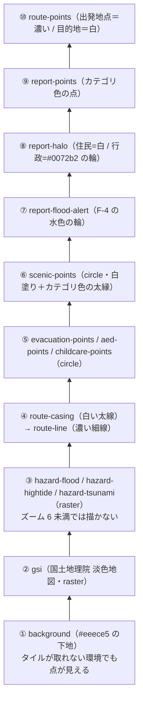

# 07. 地図

地図は **MapLibre GL JS v6.5.0**（オープンソース・**認証キー不要**）。
実装は `app/src/components/MapView.tsx`（932 行）にまとまっている。

---

## 7-1. 地図の初期化

`MapView.tsx` の「地図の生成（マウント時に 1 度だけ）」の `useEffect`。

```
① const maplibregl = await import("maplibre-gl")
      ← **動的 import。** ブラウザ専用なのでサーバー側で評価されないようにする。
        v6 で default export が無くなったので名前空間ごと受け取る
② maplibregl.setWorkerUrl("/maplibre/maplibre-gl-worker.mjs")   ← 7-3 の罠
③ new maplibregl.Map({
     container, style: basemapStyle,
     locale: { … },              ← コントロールの読み上げ・ツールチップを日本語に
     center: ICHIKAWA_CENTER,    ← [139.9312, 35.7226]
     zoom: INITIAL_ZOOM,         ← 12.4
     dragRotate: false,          ← **回転させない**（北がどちらか分からなくなるため）
     pitchWithRotate: false,
     attributionControl: false,  ← 自前で出す（④）
   })
④ コントロールを 4 つ足す
     NavigationControl（拡大縮小・コンパス無し）   … top-right
     GeolocateControl（現在地）                    … top-right
     ScaleControl（縮尺・メートル法）              … bottom-left
     AttributionControl（出典・折りたたみ）        … bottom-right
⑤ map.on("load") でソースとレイヤーを積む（7-2）
⑥ map.setPadding(overlayPadding(panel)) で操作パネルの重なりぶんを余白にする
```

**イベントハンドラは 1 度しか登録しない。** そこから見える props が古くならないよう、
`latest` という ref に毎レンダー最新値を入れて、ハンドラはそこから読む
（`MapView.tsx` の `const latest = useRef({...})`）。

### 初期表示の中心

`app/src/lib/basemap.ts`:

```ts
export const ICHIKAWA_CENTER: [number, number] = [139.9312, 35.7226];  // 市役所付近
export const INITIAL_ZOOM = 12.4;
```

`db/init/002_seed_municipalities.sql` の `center_lat`/`center_lon`/`zoom` と**同じ値**。
片方だけ変えると、地図の初期位置と DB のマスタが食い違う。

---

## 7-2. レイヤーの積み順

MapLibre は**追加した順に下から重なる**。CHIZUBA の積み順は次のとおり。



### 各レイヤーの詳細

| レイヤー ID | 種類 | ソース | 色 | 半径（ズーム 10→18） |
|---|---|---|---|---|
| `background` | background | — | `#eeece5` | — |
| `gsi` | raster | `gsi`（国土地理院） | — | タイル 256px・ズーム 2〜18 |
| `hazard-<id>-raster` | raster | `hazard-<id>` | タイル画像 | ズーム 2〜17・**描画は 6 以上** |
| `route-casing` | line | `route-line` | `#ffffff` 幅 12 | — |
| `route-line` | line | `route-line` | `#16181d` 幅 5 | — |
| `evacuation-points` | circle | `evacuation` | `#0072b2` | 3 → 12 |
| `aed-points` | circle | `aed` | `#d55e00` | 3 → 12 |
| `childcare-points` | circle | `childcare` | `#009e73` | 3 → 12 |
| `scenic-points` | circle | `scenic` | 塗り白・縁はカテゴリ色（太さ 2 → 4） | 4 → 13.5 |
| `report-flood-alert` | circle | `reports` | `#56b4e9`（不透明度 0.18） | 13 → 34 |
| `report-halo` | circle | `reports` | 行政 `#0072b2` / 住民 `#ffffff` | 6 → 16 |
| `report-points` | circle | `reports` | カテゴリ色（下記） | 4 → 13 |
| `route-points` | circle | `route-points` | 出発 `#16181d` / 目的地 `#ffffff` | 8 固定 |

**色は形でも区別できるようにしてある。**
施設の点は「色の塗り＋白い細縁」、景観スポットは「白い塗り＋カテゴリ色の太縁」、
投稿は「カテゴリ色の点＋白 or 青の輪」。**色覚多様性に配慮して形も変える**
（配色は [Okabe-Ito](https://jfly.uni-koeln.de/color/) から取っている）。

### 色の一覧（正本はそれぞれの `lib/*.ts`）

| 何 | 色 | 正本 |
|---|---|---|
| 指定緊急避難場所 | `#0072b2`（青） | `lib/layers.ts` |
| AED 設置箇所 | `#d55e00`（朱） | `lib/layers.ts` |
| 子育て施設 | `#009e73`（緑） | `lib/layers.ts` |
| 危険箇所の投稿 | `#e69f00`（橙） | `lib/reports.ts` |
| 浸水の投稿 | `#56b4e9`（水色） | `lib/reports.ts` |
| 観光おすすめの投稿 | `#cc79a7`（桃） | `lib/reports.ts` |
| 景観: まち並み / 自然 / 歴史・文化 / 生活風景 | `#0072b2` / `#009e73` / `#d55e00` / `#cc79a7` | `lib/scenic.ts` |
| 行政（公式）の印 | `#0072b2` | `MapView.tsx` の `OFFICIAL_COLOR` **と** `OfficialBadge.tsx` の `bg-[#0072b2]` |
| デモ投稿の印 | `#5b6270`（灰） | `DemoBadge.tsx` |

**行政の色だけ 2 か所に同じ値を書いている。** Tailwind v4 の任意値（`bg-[#0072b2]`）は
**class に直書きしないとビルドで拾われない**ので、JS の定数と共有できない。
コメントで「片方を変えたらもう片方も変える」と縛ってある（`MapView.tsx:90-92`）。

### MapLibre の式（expression）

色と表示の切り替えは、JavaScript ではなく MapLibre の**式**でやる。
点の数が増えても再描画が速いため。

```ts
// カテゴリごとの色（lib/reports.ts の定義から組み立てる）
["match", ["get", "category"], "hazard", "#e69f00", "flood", "#56b4e9", "spot", "#cc79a7", "#7b818b"]

// 行政の投稿だけ輪を公式色に
["case", ["==", ["get", "authorRole"], "gov"], "#0072b2", "#ffffff"]

// 表示 ON のカテゴリだけ描く
["in", ["get", "category"], ["literal", ["hazard", "flood"]]]

// 選んでいる投稿だけ縁を太く
["case", ["==", ["get", "id"], 12], 4, 1.8]
```

**定義から組み立てているので、カテゴリを 1 つ増やしても `MapView.tsx` は変えなくてよい。**

---

## 7-3. worker の罠

**CHIZUBA で最も再現しにくい不具合。** 知らないと 1 日溶ける。

### 症状

**背景地図（ラスタタイル）は出るのに、GeoJSON の点が永久に読み込み中のまま。**
エラーもコンソールに出ない。

### 原因

MapLibre GL JS **v6 から Web Worker が本体と別の `.mjs` になり、
`import.meta.url` を基準に `./maplibre-gl-worker.mjs` を読みに行く**実装に変わった。
バンドルすると `import.meta.url` はバンドル済みチャンクの URL になるので、
MapLibre は存在しない `/_next/static/chunks/maplibre-gl-worker.mjs` を読もうとして
**無言で失敗する**。

（Web Worker ＝ ブラウザが裏で走らせる別スレッド。MapLibre は GeoJSON の
解析やタイルの組み立てをここでやる。ラスタタイルは worker を使わないので出る。）

### 対処（2 つで 1 組）

```
① app/scripts/copy-maplibre-worker.mjs
   node_modules から maplibre-gl-worker.mjs と maplibre-gl-shared.mjs を
   public/maplibre/ にコピーする。npm run dev / build の前に自動で走る

② app/src/components/MapView.tsx
   maplibregl.setWorkerUrl("/maplibre/maplibre-gl-worker.mjs")
```

**2 本コピーするのは、worker が `./maplibre-gl-shared.mjs` を import するから。**
1 本だけだと同じ症状になる。

`node_modules` からコピーするので、`maplibre-gl` を更新すれば中身も自動で追従する。
`public/maplibre/` は **git 管理外**（ビルド生成物）。

参考: [MapLibre GL JS の API ドキュメント](https://maplibre.org/maplibre-gl-js/docs/API/)（`setWorkerUrl` の記載あり・2026-09-03 確認）。

---

## 7-4. タイルのソース

### 背景地図（国土地理院「淡色地図」）

```ts
tiles: ["https://cyberjapandata.gsi.go.jp/xyz/pale/{z}/{x}/{y}.png"]
tileSize: 256, minzoom: 2, maxzoom: 18
```

- **認証キー不要。** 出典を明記すれば自由に利用できる
  （[国土地理院タイル一覧](https://maps.gsi.go.jp/development/ichiran.html)・
  2026-09-03 に取得して「淡色地図」の記載を確認）
- 実タイルの取得も確認済み（`…/xyz/pale/12/3637/1612.png` が HTTP 200・67 KB）
- **`background` レイヤーを下に敷いてある**ので、タイルが取れない環境でも
  点と経路は読める

### ハザードマップ

```
https://disaportaldata.gsi.go.jp/raster/<データ名>/{z}/{x}/{y}.png
```

4 種類（[04 章 4-1](04-features.md#4-1-f-1-ハザードマップ表示)）。
配信仕様は <https://disaportal.gsi.go.jp/hazardmap/copyright/opendata.html>
（2026-09-03 に取得して `01_flood_l2_shinsuishin_data` の記載を確認）。
実タイルの取得も確認済み（HTTP 200・17 KB）。

**凡例の色は実際に配信されているタイルの画素を数えて確かめたもの**
（浸水は 2026-08-24・千葉県内 20 タイル、土砂災害は 2026-09-04・市川市北部の 5 タイル。
`lib/hazards.ts` の冒頭コメント）。土砂災害の 4 色は
[公式の凡例画像](https://disaportal.gsi.go.jp/hazardmap/copyright/img/keikai_kyukeisya.png)
の画素とも一致することを確認した。
洪水は 6 段階、津波・高潮は 8 段階で、**同じ色でも表す浸水深が違う**。
まとめて 1 つの凡例にすると誤読するので分けてある。

---

## 7-5. ポップアップ

**施設・景観スポットのポップアップは React ではなく素の DOM で組み立てる**
（`MapView.tsx` の `buildPopup()` / `buildScenicPopup()`）。
MapLibre のポップアップに React を差し込むには別の仕組みが要るため。

### 共通の骨組み（`popupShell`）

```ts
root.className = `flex max-h-[40dvh] ${size} flex-col text-ink md:max-h-[62dvh]`;
scroll.className = "min-h-0 flex-1 overflow-y-auto overscroll-contain";
```

**MapLibre はポップアップを点の上か下に置くだけで、入りきらなくても縮めない。**
だから自分で高さの上限（スマホで 40dvh ＝ 地図の高さの約半分）を決め、
あふれる中身は縦にスクロールさせる。
**「ここへナビ」だけは下に固定**して、スクロールせずに押せるようにする。

### 値は `textContent` で入れる

```ts
dd.textContent = value;   // innerHTML ではない
```

オープンデータの中の記号や山かっこが markup として解釈されないようにするため
（`MapView.tsx` の `popupRow()`）。

### 景観スポットのポップアップだけ持つもの

| 要素 | 中身 |
|---|---|
| 写真の帯 | 写真がある 54 か所だけ。**作者名とライセンスを写真の上に重ねる**（CC BY / CC BY-SA は作者表示が条件） |
| カテゴリのタグ | 1 件が最大 3 つ持つ |
| 言語の切り替え | 「日本語」「English」。**解説と項目名だけ**差し替える（名称は日英とも常に出す） |
| `placeNote` | **撮影地が市川市の外のものだけ**先に断る（現在は三番瀬の 1 件） |

**機械翻訳や要約はしない。** 元データの日英解説を「そのまま出す」だけ
（出典のデータを改変しないため。`MapView.tsx` の `buildScenicPopup` の冒頭コメント）。

---

## 7-6. 地図の余白（`setPadding`）

操作パネルが地図に重なっているので、**重なっているぶんを余白として MapLibre に伝える**。
これがないと、初期表示も経路の `fitBounds` もパネルの裏を中心にしてしまう。

```ts
function overlayPadding(panel: PanelBox): PaddingOptions {
  const wide = window.matchMedia("(min-width: 768px)").matches;
  const gap = 24;
  return wide
    ? { top: gap, right: gap, bottom: gap, left: Math.round(panel.width) + gap * 2 }
    : { top: gap, right: gap, bottom: Math.round(panel.height) + gap, left: gap };
}
```

**パネルの大きさは実測値**（`MapExplorer.tsx` が `ResizeObserver` で測って渡す）。
スマホでは開閉で高さが大きく変わるため、決め打ちにできない。

---

## 7-7. モードの切り替え（S-1 防災 ⇄ S-2 観光）

**地図は作り直さない。** 変えるのは「最初から表示する組」だけ。

`app/src/lib/mapModes.ts` の `MAP_MODES`:

| | 防災（`disaster`・既定） | 観光（`tourism`） |
|---|---|---|
| 施設レイヤー | 避難場所・AED・子育て施設（3 本とも ON） | なし |
| 景観100選 | OFF | **ON** |
| ハザード | `hazards.ts` の既定に従う（洪水だけ ON） | 全部 OFF |
| 投稿のカテゴリ | 危険箇所・浸水 | 観光おすすめ |
| 投稿できるカテゴリ | 危険箇所・浸水 | 観光おすすめ |

**ここが決めるのは初期値だけ。** 切り替えたあと個別に足し引きするのは自由で、
「観光モードのまま避難場所も重ねる」ことはできる。

切り替え時に `MapExplorer.changeMode()` がやること:

```
setVisible / setHazardVisible / setReportVisible / setScenicVisible を初期値に戻す
setSelectedReportId(null) / setComposing(null) / setPickTarget(null)  ← 開いていたものを閉じる
URL の ?mode= を書き換える（history.replaceState）
```

**URL に残すので、共有したリンクと再読み込みで同じモードに戻る。**

---

## 7-8. 現在地ボタン

**MapLibre の `GeolocateControl` をそのまま使っている。**

```ts
new maplibregl.GeolocateControl({
  positionOptions: { enableHighAccuracy: true, timeout: 10_000 },
  trackUserLocation: false,   // 追従は切る。1 回寄せられれば足りる
  showAccuracyCircle: true,
});
```

- **位置情報を拒否されたときはコントロール自身がボタンを無効にする**（静かに使えなくなる）。
  `geolocate.on("error", () => {})` で明示的に受けているのは、
  Evented が「error に聞き手がいないとコンソールへ吐く」ため。画面に出すことは何も無い
- 取れた位置は `onGeolocate` で `MapExplorer` に渡り、**徒歩ナビの出発地点として使い回す**
- **`localhost` か HTTPS でないと動かない**（ブラウザの仕様）。
  `docker compose up` 後に `http://localhost:3000` を開けば問題ない

なお、徒歩ナビの「現在地から最寄りの地点へ」は
`GeolocateControl` ではなく `navigator.geolocation.getCurrentPosition()` を直接呼ぶ
（`MapExplorer.tsx` の `currentPosition()`）。取れなければ
**地図クリックでの指定に自動で切り替える**。

---

## 7-9. 地図を触るときの注意

| やりたいこと | 触る場所 |
|---|---|
| 施設のレイヤーを 1 本足す | `lib/layers.ts` の `LAYERS` に 1 要素。`MapView.tsx` は**変えなくてよい**（`for (const layer of LAYERS)` で回している） |
| 投稿のカテゴリを増やす | `lib/reports.ts` の `REPORT_CATEGORIES` に 1 要素 ＋ `001_schema.sql` の `CHECK` に値を足す |
| ハザードを 1 本足す | `lib/hazards.ts` の `HAZARDS` に 1 要素。凡例が新しい段階なら `HAZARD_LEGENDS` にも |
| 初期表示の位置を変える | `lib/basemap.ts` **と** `002_seed_municipalities.sql` の**両方** |
| ロゴを変える | `app/src/app/icon.svg` **と** `components/BrandMark.tsx` の**両方**（同じ図形を写している） |

`AGENTS.md` の整合性表では、地図に載せるデータを足したときに
`data/scripts/build_geojson.py`・`lib/layers.ts`（景観は `lib/scenic.ts`）・
`lib/credits.ts`・`app/README.md`・`requirements.md` §7-2 を同じコミットで直すことになっている。
