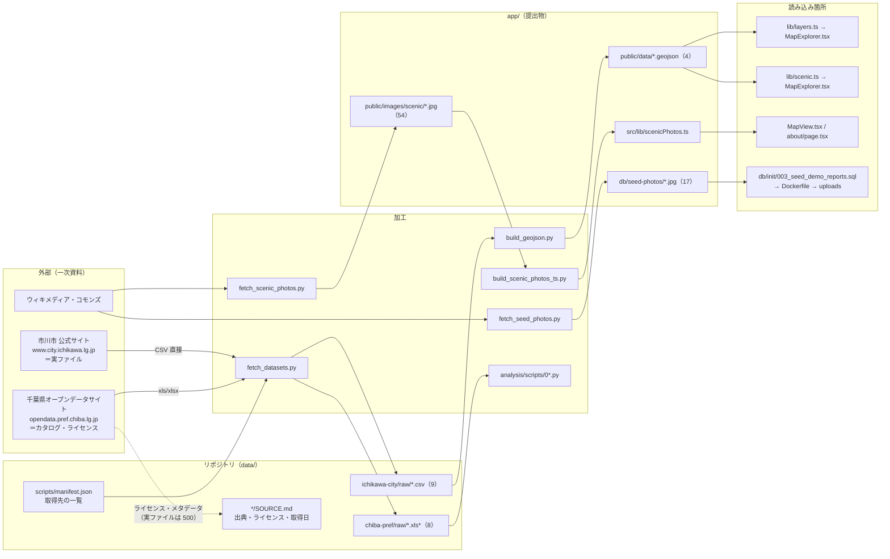

# 09. データパイプライン

**元データ → 加工スクリプト → 同梱ファイル → アプリの読み込み箇所**の対応。

**元データが直接アプリに入ることはない。** 必ず `data/scripts/` のどれかを通る。

---

## 9-1. 全体像



---

## 9-2. 取得先が 2 段になっている理由（重要）

**カタログは千葉県、実ファイルは市川市公式から取る。**

千葉県オープンデータサイトの `resource_download/<id>` は、
**市川市のリソースに対して HTTP 500 を返す**。

実測（2026-09-03・`curl -sSL -o /dev/null -w "%{http_code}"`）:

| URL | HTTP |
|---|---|
| `https://opendata.pref.chiba.lg.jp/resource_download/53961` | **500** |
| `https://opendata.pref.chiba.lg.jp/resource_download/53977` | **500** |
| `https://opendata.pref.chiba.lg.jp/datasets/3295`（データセットページ） | 200 |
| `https://www.city.ichikawa.lg.jp/uploaded/attachment/53552.csv`（実ファイル） | 200・27,378 B |

`data/ichikawa-city/SOURCE.md` にも 2026-08-24 時点で同じ現象が記録されている。
**約 10 日後の 2026-09-03 も同じ**なので、一時的な障害ではない。

そこで:

| 何を | どこから | なぜ |
|---|---|---|
| **実ファイル**（CSV） | 市川市公式サイト `.../uploaded/attachment/<番号>.csv` | 県サイト経由は 500 で落とせない |
| **ライセンス・更新日・データセット名** | 千葉県オープンデータサイトの各リソースページ | カタログとして整備されているのはこちら |

**同一性は確認済み。** 手元の `data/ichikawa-city/raw/emergency_evacuation_sites.csv` と
市公式から取り直した `53552.csv` の SHA-256 が完全一致した（2026-09-03 実測）:

```
9482bf10f7abd7f6aa26924f975c54209ee3055312e2c14bd0541f7406283b96
```

---

## 9-3. 元データの対応表

### 市川市オープンデータ（`data/ichikawa-city/raw/`）

- 取得元: <https://www.city.ichikawa.lg.jp/page/4744.html>（2026-09-03 に 200 を確認）
- 取得日: **2026-08-24**／データの時点: 令和 8 年 4 月 1 日公開
- ライセンス: **CC BY 4.0**（出典を書けば二次利用・改変・再配布が可能）
- 形式: すべて **CSV・cp932（Shift_JIS）・CRLF**
- 出典の書き方: `「【市川市】○○」（市川市オープンデータ）（データセットのURL）を加工して作成`

| ファイル | 行数（ヘッダ込み） | データセット | アプリで使うか |
|---|---|---|---|
| `emergency_evacuation_sites.csv` | 130 | [3295 指定緊急避難場所一覧](https://opendata.pref.chiba.lg.jp/datasets/3295) | **使う** → `evacuation_sites.geojson` |
| `aed_locations.csv` | 306 | [3288 AED設置箇所一覧](https://opendata.pref.chiba.lg.jp/datasets/3288) | **使う** → `aed_locations.geojson` |
| `childcare_facilities.csv` | 389 | [3283 子育て施設一覧](https://opendata.pref.chiba.lg.jp/datasets/3283) | **使う** → `childcare_facilities.geojson` |
| `scenic_spots.csv` | 101 | [3291 景観100選](https://opendata.pref.chiba.lg.jp/datasets/3291) | **使う** → `scenic_spots.geojson` |
| `population_by_area_and_age.csv` | 238 | 3282 地域・年齢別人口 | 分析のみ |
| `public_facilities.csv` | 331 | 3280 公共施設一覧 | 未使用 |
| `parks_and_green_spaces.csv` | 437 | 3293 都市公園・都市緑地一覧 | 未使用 |
| `nursing_care_facilities.csv` | 56 | 3287 介護サービス事業所一覧 | 未使用 |
| `medical_relief_stations.csv` | 7 | 3297 医療救護所 | 未使用 |

### 千葉県オープンデータ（`data/chiba-pref/raw/`）

- 取得元: <https://opendata.pref.chiba.lg.jp/>（運営: 一般社団法人データクレイドル）
- 取得日: **2026-08-24**
- ライセンス: **PDL1.0（公共データ利用規約 第 1.0 版）**。
  [規約本文](https://opendata.pref.chiba.lg.jp/pages/terms)（2026-09-03 に 200 と本文中の
  「公共データ利用規約」を確認）
- **アプリには 1 件も載らない。** 分析（`data/analysis/`）と発表資料の根拠として使う

| ファイル | データセット |
|---|---|
| `population_by_municipality_2024.xlsx` | [240 令和6年千葉県毎月常住人口調査報告書(年報)](https://opendata.pref.chiba.lg.jp/datasets/240) の「第1表 市区町村別推計人口」 |
| `natural_change_by_municipality_2024.xlsx` | 同 240 の「第2表 市区町村別自然動態（男女別）」 |
| `social_change_by_municipality_2024.xlsx` | 同 240 の「第3表 市区町村別社会動態（男女別）」 |
| `elderly_by_municipality_1995.xls` / `2015.xls` / `2021.xlsx` | [813 県内市町村別の高齢者人口](https://opendata.pref.chiba.lg.jp/datasets/813) |
| `licensed_nursery_schools_2023.xlsx` | [421 子育て施設一覧（認可保育所）](https://opendata.pref.chiba.lg.jp/datasets/421) |
| `tourism_visitors_2019.xls` | [793 令和元年千葉県観光入込調査報告書](https://opendata.pref.chiba.lg.jp/datasets/793) |

### ウィキメディア・コモンズ

- 取得元: <https://commons.wikimedia.org/>
- 取得日: **2026-08-27**
- **再利用が許されるものだけ**（CC0・パブリックドメイン・CC BY・CC BY-SA）。
  NC（非営利限定）・ND（改変禁止）・ライセンス不明は 1 枚も使っていない
- **加工した点は「長辺 1000 px への縮小」と「JPEG への再圧縮」だけ。**
  切り抜き・色調整・合成はしていない
- 用途は 2 つ:

| 用途 | 枚数 | 置き場 | 台帳 |
|---|---|---|---|
| 景観スポットの写真（F-5） | **54**（100 か所中） | `app/public/images/scenic/` | `app/src/lib/scenicPhotos.ts`（自動生成）・`data/wikimedia-commons/SOURCE.md` |
| デモ投稿の写真 | **17** | `app/db/seed-photos/` | `app/src/lib/credits.ts` の `DEMO_PHOTO_CREDITS`・同 SOURCE.md |

**`data/` 配下に画像は置いていない**（同じ 4 MB を 2 か所に持たないため）。

---

## 9-4. `build_geojson.py` — CSV → GeoJSON

```bash
python3 data/scripts/build_geojson.py    # リポジトリのルートで
```

**外部ライブラリを使わない**（python3 の標準ライブラリだけ）。

### やっていること

| 処理 | 理由 |
|---|---|
| **cp932 で読む** | 市川市の CSV は UTF-8 では開けない |
| 中身が空の行を落とす | CSV の末尾にパディングの空行が入っているファイルがある |
| 緯度経度が空の行を落とす | 地図に置けない |
| **市域の外に飛んでいる座標を落とす** | 元データに経度の打ち間違いが 1 件ある |
| 列名を英字のキーに正規化 | アプリ側の型定義を素直にするため |
| **値が空のキーは出力しない** | GeoJSON を小さくし、画面側で「あるものだけ出す」を素直に書けるようにする |
| `attribution` を FeatureCollection に埋める | 出典をデータ本体に持たせ、アプリ側の表示とずれないようにする |

市域の箱（`BBOX_LAT = (35.60, 35.82)` / `BBOX_LON = (139.84, 140.02)`）は
`db/init/002_seed_municipalities.sql` の `bbox_*` と**同じ値**。

### 実行結果（2026-09-03 に再実行した実測）

```
evacuation_sites.geojson:     123 件 / CSV 129 行（空行 6 件・緯度経度なし 0 件・市域外 0 件を除外）
aed_locations.geojson:        304 件 / CSV 305 行（空行 0 件・緯度経度なし 0 件・市域外 1 件を除外）
    市域外として除外: ローソンストア100市川南八幡三丁目店（35.716565, 129.925207）
childcare_facilities.geojson: 388 件 / CSV 388 行（空行 0 件・緯度経度なし 0 件・市域外 0 件を除外）
scenic_spots.geojson:         100 件 / CSV 100 行（空行 0 件・緯度経度なし 0 件・市域外 0 件を除外）
```

**再実行してもコミット済みの GeoJSON とバイト単位で一致する**
（`git status --porcelain app/public/data/` が空。＝スクリプトが再現可能）。

**除外された 1 件は元データの打ち間違い。** 経度が `129.925207` になっていて、
市川市（経度 139.9 付近）から **西へ約 903 km**（対馬海峡付近の海上）を指している。
正しくは `139.925207` と思われるが、**推測で直さず落とす**方針にしてある
（`data/ichikawa-city/SOURCE.md` に記録）。

### 列の対応（GeoJSON の properties）

| GeoJSON のキー | CSV の列 | どのデータ |
|---|---|---|
| `name` | `名称` | 全部 |
| `address` | `所在地_連結表記` | 全部 |
| `area` | `所在地_町字` | 全部 |
| `disasters`（配列） | `災害種別_洪水` ほか 8 列で `1` のもの | 避難場所 |
| `capacity` | `想定収容人数` | 避難場所 |
| `spot` | `設置位置` | AED |
| `days` | `利用可能曜日` | AED |
| `hours` | `開始時間` - `終了時間` | AED・子育て |
| `note` | `利用可能日時特記事項` | AED |
| `category` | `種別` | 子育て |
| `ages` | `受入年齢` | 子育て |
| `nameEn` / `description` / `descriptionEn` / `access` | `名称_英語` / `説明` / `説明_英語` / `アクセス方法` | 景観 |
| `categories`（配列） / `categoryPrimary`（文字列） | `備考` を「、」で分割 | 景観 |
| `tel` / `url` | `電話番号`（景観は `連絡先電話番号`）/ `URL` | 全部 |

**`categoryPrimary` を別に持つ理由**: MapLibre は GeoJSON の配列プロパティを
文字列に畳んでしまい、色分けの式（`match`）から配列として読めない。
だから**色を決める主カテゴリだけ文字列の別キー**にしてある。

### 使わなかった列

景観100選の `画像` / `画像2` 列は `ATTACH/...` の相対パスで、
**配信先が見つからない**（市サイトの想定される 3 通りの URL すべてで 404 を実測）。
区切りがバックスラッシュの行が 69 件あり表記も揃っていないため、**使わない**。
写真はウィキメディア・コモンズから別途集めた（9-5）。

---

## 9-5. 景観スポットの写真（54 枚）

```bash
python3 data/scripts/fetch_scenic_photos.py --credits   # 写真と出典を取得
python3 data/scripts/build_scenic_photos_ts.py          # scenicPhotos.ts を生成
```

**`app/src/lib/scenicPhotos.ts` は自動生成物なので直接編集しない。**

### 実測した落とし穴

**① スポット名で検索すると同名別所が大量に混ざる**

実際に混ざった例（`.agent/progress.md` 2026-08-27）:

- 愛知県日進市の**弁天池公園**
- 岐阜県北方町の**北方小学校**
- 郡山市立**行徳**小学校
- 静岡の**徳願寺**
- **宗谷**岬（市川市の「曽谷」と読みが同じ）
- 春日部市の**八幡神社**

**対処**: `geosearch`（座標での検索）か専用カテゴリで裏を取り、**最後に目視で 1 枚ずつ確かめる**。
選定の記録は `data/wikimedia-commons/SOURCE.md`。

**② `imageinfo.thumburl` は元が指定幅より小さいと原寸 URL を返す**

そのまま落とすと **1 枚 10 MB・12 秒**かかった。
`Special:FilePath/<名前>?width=N` なら必ず縮小版が返る。

### 出典の出し方

CC BY と CC BY-SA は**作者の表示が条件**なので、2 か所に出す。

| どこ | 何を出すか |
|---|---|
| 地図のポップアップ | 写真の上に「撮影: 作者名 / ライセンス名」を重ねる。作者名 → コモンズの説明ページ、ライセンス名 → その条文へリンク |
| `/about` の「景観100選のスポット写真」 | 全 54 枚の一覧 |

**撮影地が市川市の外のものだけ `placeNote` で先に断る**
（現在は三番瀬の 1 件で、値は「船橋市側から撮影」。`scenicPhotos.ts:307`）。

---

## 9-6. デモ投稿の写真（17 枚）

```bash
python3 data/scripts/fetch_seed_photos.py
```

置き場は `app/db/seed-photos/`（**提出物に含める**）。
`Dockerfile:50` が `/app/uploads` に配り、`003_seed_demo_reports.sql` が
`report_photos` にファイル名と `byte_size` を登録している。

**`byte_size` は実物と一致させること。** `report_photos` の CHECK
（`byte_size > 0 AND byte_size <= 5242880`）に引っかかる。

### 撮影地の断り（**最重要**）

| 区分 | 枚数 | 扱い |
|---|---|---|
| **市川市で撮影** | 10 | 観光のデモ投稿でその場所の写真として使う |
| **市外で撮影** | 7 | 防災のデモ投稿に付けた**参考写真**。**市川市で実際に起きた被害の写真ではない** |

令和 8 年 8 月千葉豪雨をはじめとする**実際の災害の記録として使ってはいけない**。
この断りは `/about` にも書いてある（`data/wikimedia-commons/SOURCE.md`・
`app/src/lib/credits.ts`）。

---

## 9-7. 分析（`data/analysis/`）— アプリには載らない

```bash
python3 data/scripts/fetch_datasets.py
for s in data/analysis/scripts/0*.py; do data/analysis/.venv/bin/python "$s"; done
```

| スクリプト | 出す図 |
|---|---|
| `01_chiba_aging.py` | 千葉県の高齢化率（2021）・推移 |
| `02_chiba_population_dynamics.py` | 自然動態と社会動態・保育所定員 |
| `03_ichikawa_population.py` | 市川市の人口ピラミッド・地区別の高齢化格差 |
| `04_ichikawa_facility_gap.py` | 高齢者あたり AED・施設への到達・子どもと施設 |

出力は `data/analysis/figures/*.png`（9 枚）。
**図中に必ず出典を書く**（`data/analysis/scripts/common.py` の `caption()`）。
所見は `data/analysis/findings.md`。

これらは**発表資料の根拠**として使うもので、アプリのビルドにも実行にも関与しない。

---

## 9-8. データを足すときの手順

`AGENTS.md` の整合性表より。

| やること | 直すファイル |
|---|---|
| `data/` に取得先を追加 | `data/scripts/manifest.json` と `data/<ソース>/SOURCE.md` |
| 地図に載せるデータを追加・変更 | `data/scripts/build_geojson.py`・`app/src/lib/layers.ts`（景観は `scenic.ts`）・`app/src/lib/credits.ts`・`app/README.md`・`docs/design/requirements.md` §7-2 |
| 景観スポットの写真を足す | `fetch_scenic_photos.py` の `SPOT_PHOTOS` に 1 行 → `--credits` 付きで実行 → `build_scenic_photos_ts.py` → `data/wikimedia-commons/SOURCE.md` の表と「写真が見つからなかったスポット」を直す。**目視でその場所か確かめてから採る** |
