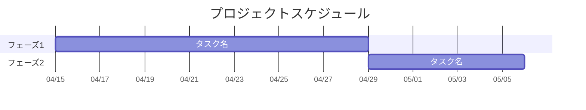
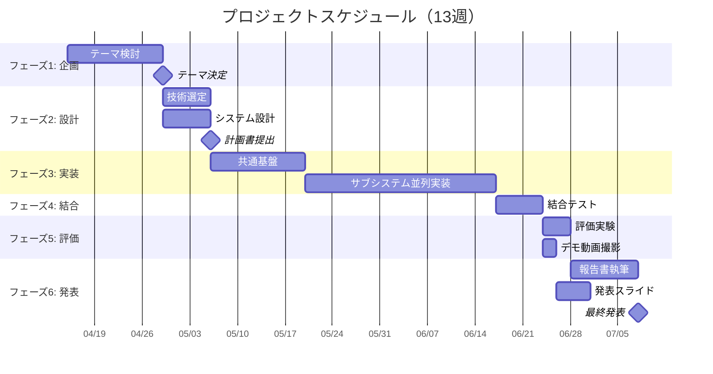

# ガントチャート

Mermaid でスケジュールを描く。詳細なタスクは [wbs.md](wbs.md) を参照。

GitHub の Markdown プレビューは Mermaid を自動でレンダリングするので、
図を別ツールで作って画像を貼る必要はない。**テキストなので差分も見える。**

## 全体スケジュール

📋 記入例（13 週間のプロジェクトの場合）— クリックで開く

## Mermaid の書き方（最低限）

| 書き方 | 意味 |
|---|---|
| `タスク名 :id, 2026-04-15, 14d` | 開始日と期間を指定 |
| `タスク名 :id, after a1, 7d` | 別のタスクの後から開始 |
| `タスク名 :milestone, after a1, 0d` | 節目（ひし形で表示される） |
| `タスク名 :done, id, ...` | 完了済み（グレー表示） |
| `タスク名 :active, id, ...` | 進行中（強調表示） |

## 備考

- 日付は暫定でよい。実際の授業日程が出たら調整する
- タスクは [wbs.md](wbs.md) と必ず対応させる（片方だけ更新すると必ずズレる）
- **遅れたら線を伸ばす。** 予定のまま放置された図はチームを油断させる
